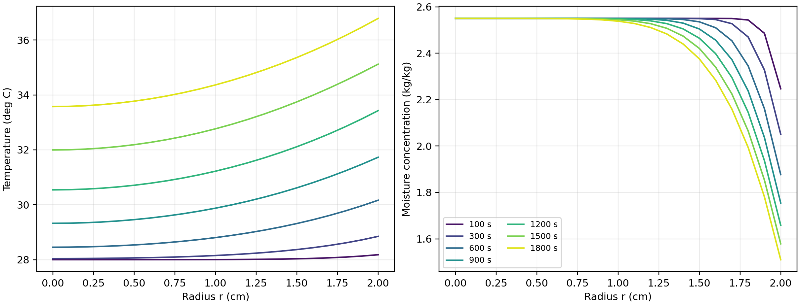
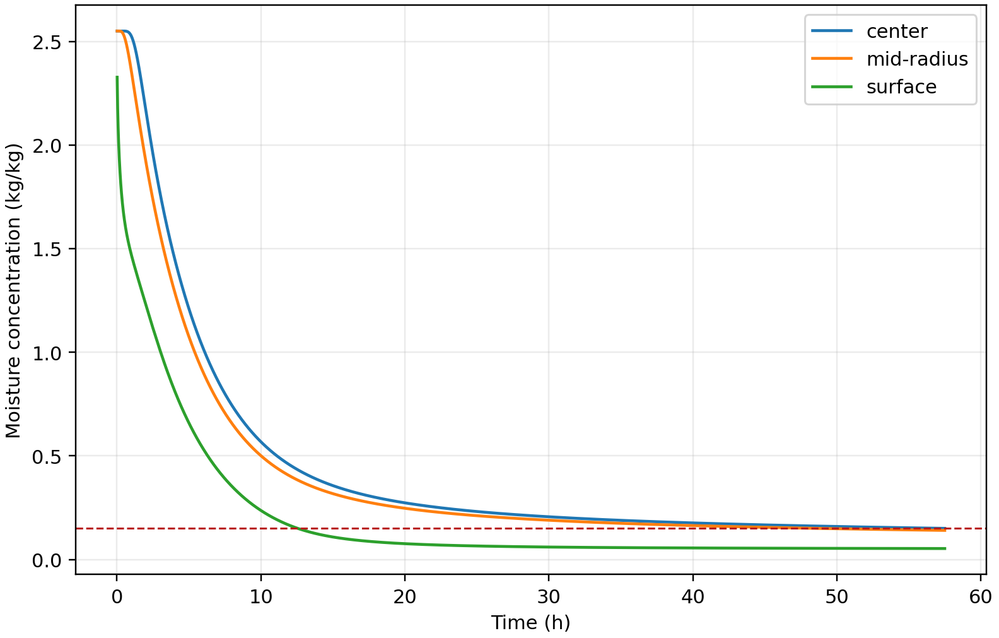
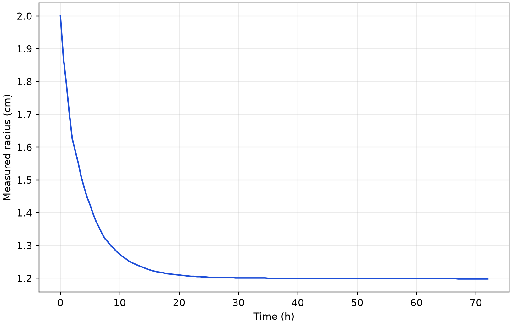

# 基于变物性传热传质与移动边界的药材烘干模型

## 摘要

针对圆柱形药材热风烘干中的内部温度、水分分布与干燥时长问题，本文建立由固定域预热模型、变物性温湿耦合模型和实测收缩驱动的移动边界模型组成的统一求解框架。以干基含水率为水分变量，采用圆柱环形有限体积离散、隐式 BDF 时间积分与两级网格 Richardson 外推，计算题目指定的时空分布。

针对问题一，采用常热物性导热方程和浓度相关扩散方程。计算得到 1800 s 时中心、表面温度分别为 33.5753、36.7856 ℃，对应干基含水率为 2.5500、1.5102 kg/kg。温度向内部传递较快，失水主要集中于表层。

针对问题二，从初始时刻统一使用附录 3 的经验物性，联立求解温度和含水率。3 h 时中心、表面温度分别为 49.8495、49.9664 ℃，含水率分别为 1.7662、1.0081 kg/kg，说明接近热平衡并不意味着干燥完成。表 3、表 4 给出前三小时结果，支撑材料提供到干燥终点后首个整分钟的逐秒完整场。

针对问题三，将附件 1 最后一小时均值作为 4 h 后的恒温干燥环境，以全域最大含水率低于 0.15 kg/kg 为条件。固定半径模型的临界时长为 57.4740 h；若按整分钟停止，应取 57.4833 h。长期环境的不同平台解释产生约 57.24—57.83 h 的情景范围，该范围不属于统计置信区间。

针对问题四，利用附件 2 的半径历史，令归一化坐标为物理半径与当前半径之比，从均匀收缩下的干物质和水分守恒推导移动域方程。临界时长为 51.0920 h，整分钟严格达标时长为 51.1000 h。采用附录 4 相同物性而保持初始半径的对照结果约为 129.8481 h，表明几何收缩在该模型中显著缩短迁移时间。

通过网格加密、通量平衡、独立离散和输入情景比较检验数值结果。两类终点的相邻外推估计差约为 1 s；但经验密度与实测收缩存在相容性限制，一维近似和气固有效边界也尚缺独立实验验证，因此所给时长是明确假设下的模型预测。

关键词：药材烘干；传热传质；有限体积法；移动边界；干燥终点

<!-- PAGEBREAK -->

## 1 问题重述与分析

### 1.1 任务及数据

题目研究长 25 cm、初始半径 2 cm 的圆柱形药材，其初始温度为 28 ℃，初始干基含水率为 2.55 kg/kg。附件 1 提供烘房初期温度及含湿量，附件 2 提供药材半径随时间的变化。所求结果不仅包含平均干燥趋势，还包括指定物理半径处的局部温度和含水率，因此必须建立具有空间分辨能力的模型 [1]。

四问逐步改变物性与几何条件：第一问计算固定半径的 30 min 预热过程；第二问在整个过程统一使用附录 3 的变物性，列示前三小时的温湿分布；第三问在同一模型中确定各处含水率均低于 0.15 kg/kg 所需时间；第四问同时采用附录 4 物性和实测收缩历史，重新确定终点。第三问承接第二问的方程和初值，而第二问并非第一问在 1800 s 后切换参数的续段。

### 1.2 模型选择

只描述平均水分比的经验曲线不能直接提供题目要求的径向分布，也不能用平均含水率代替“各处达标”。本文以 Fourier 导热和 Fick 有效扩散作为内部传输模型，以表面对流边界连接烘房环境。圆柱物料干燥的热质耦合属于已有研究方向 [2]；非等温移动边界模型也已用于描述食品干燥与收缩 [3]。本文只借鉴其建模层次，不移用其他物料的参数或实验精度。

药材长径比为 6.25，本文将径向结果解释为圆柱中截面的分布，采用一维轴对称近似。由常物性到变物性，再到移动边界，逐层增加题目提供的信息，避免引入无法从附件识别的力学参数。第四问的半径是观测输入，不再另设需要拟合的收缩预测方程；这与根据局部收缩速度预测几何的文献模型 [3] 有所区别。

## 2 模型假设与符号

### 2.1 基本假设

（1）药材为径向各向同性、轴对称连续介质，忽略周向差异及中段轴向梯度。端面效应尚未通过二维计算量化，不用径向网格收敛替代该项验证。

（2）第一至第三问半径不变；第四问长度不变、截面均匀径向收缩，整体半径历史适用于所研究的中截面。

（3）初始温度和干基含水率均匀。热物性与扩散率按各问指定附录取局部状态值，不另行拟合参数。

（4）附件 1、附件 2 均作分段线性插值。4 h 后的烘房环境以最后一小时均值为基准平台，末观测之后用 60 s 过渡到平台；这是长期环境假设。

（5）第二至第四问未另给表面系数，故沿用第一问的传热系数 25 W/(m²·K) 和传质系数 8×10⁻⁷ m/s。气相含湿量与固相干基含水率的质量基准不同，在缺少吸附等温线时，将二者之差解释为有效传质推动力。

（6）未显式加入蒸发潜热、热湿交叉迁移和力学应力。经验密度与比热的乘积用作有效体积热容，不同时声称它与水分方程构成严格的多组分热力学闭合。

（7）第四问干物质无损失、初始干物质体积密度均匀；在均匀收缩下，该干密度只随时间变化。此处的守恒干密度与附录经验密度分开定义，二者的相容性在第 8 节检验。

### 2.2 主要符号

| 符号 | 含义 | 单位 |
|---|---|---|
| $t$ | 自烘干起点计的时间 | s |
| $r,R(t),R_0$ | 物理半径、当前表面半径、初始表面半径 | m |
| $\xi=r/R(t)$ | 随材料运动的归一化径向坐标 | 1 |
| $T,T_K$ | 摄氏温度、开尔文温度 | ℃、K |
| $C$ | 固相干基含水率 | kg/kg |
| $T_\infty,C_\infty$ | 烘房温度、环境含湿量 | ℃、kg/kg |
| $\rho,c_p,k$ | 经验密度、比热容、导热系数 | kg/m³、J/(kg·K)、W/(m·K) |
| $D$ | 有效水分扩散率 | m²/s |
| $h_T,h_m$ | 对流传热、有效传质系数 | W/(m²·K)、m/s |
| $\rho_d,v_r$ | 当前干物质体积密度、径向骨架速度 | kg/m³、m/s |
| $t_*,t_{60}$ | 临界时刻、其后首个严格达标整分钟 | s |

所有计算距离使用 m，表格按题意显示 cm；内部温度保存为 ℃，只在扩散率的 Arrhenius 项中换算为 K。后文的“水分浓度”均指题目定义的干基含水率。

## 3 数据准备与统一数值方法

### 3.1 数据核验及环境延拓

附件 1 含 241 组记录，覆盖 0—14400 s，间隔 60 s；附件 2 含 145 组记录，覆盖 0—259200 s，间隔 1800 s。提取后的两份 CSV 与原始工作簿逐值相同。半径从 2.000 cm 降至末段的 1.198 cm；原始观测值保留，不以拟合曲线代替输入。

对相邻观测点，环境或半径变量 $f$ 采用

$$
f(t)=f_i+\frac{t-t_i}{t_{i+1}-t_i}(f_{i+1}-f_i),\quad t_i\le t\le t_{i+1}. \qquad (1)
$$

附件 1 最后一小时包含 61 个观测点，温度和含湿量均值分别为 49.998934 ℃、0.04998754 kg/kg，标准差分别为 0.154353 ℃、0.00015013 kg/kg。对应线性趋势约为 0.002824 ℃/h 和 −0.00001288 kg/(kg·h)。尾段接近平台为长期延拓提供了依据，但不能证明未来两天环境保持不变。第 8 节单独比较不同延拓情景。

### 3.2 环形有限体积离散

在径向节点周围构造环形控制体。省略所有单元共有的轴向长度后，控制体体积与外侧面积分别为 $V_i=\pi(r_{i+1/2}^2-r_{i-1/2}^2)$、$A_{i+1/2}=2\pi r_{i+1/2}$。对一般传输变量 $u$，令蓄积系数为 $s$、输运系数为 $\Gamma$，半离散方程为

$$
s_iV_i\frac{\mathrm du_i}{\mathrm dt}=A_{i+1/2}\Gamma_{i+1/2}\frac{u_{i+1}-u_i}{\Delta r}-A_{i-1/2}\Gamma_{i-1/2}\frac{u_i-u_{i-1}}{\Delta r}. \qquad (2)
$$

对热传导取 $u=T,s=\rho c_p,\Gamma=k$；对有效水分扩散取 $u=C,s=1,\Gamma=D$。界面系数采用调和平均：

$$
\Gamma_{i+1/2}=\frac{2\Gamma_i\Gamma_{i+1}}{\Gamma_i+\Gamma_{i+1}}. \qquad (3)
$$

圆心控制体的内侧面积为零，因此不直接计算 $1/r$ 的奇异表达；表面控制体将外侧项替换为题设 Robin 通量。相邻单元的内部通量大小相等、符号相反，求和后只剩边界通量，便于独立核查离散平衡。

### 3.3 时间积分、正性与外推

扩散离散后得到刚性常微分方程组，使用 BDF 隐式积分。水分状态设为 $z=\ln C$，利用 $z_t=C_t/C$ 更新，再由 $C=\exp z$ 恢复含水率，从状态表达上避免负浓度。该变换不改变原水分方程；时间步长由积分器自适应选择，输出间隔与积分步长是两个不同概念。

在共同的物理输出节点上，对间隔数为 $N$、$2N$ 的两级解作二阶 Richardson 外推：

$$
u_{\rm ext}=\frac{4u_{2N}-u_N}{3}. \qquad (4)
$$

外推用于减小空间误差；它依赖渐近二阶误差假设，不能保证每一个四位小数都是真值。第一问使用 5120/10240 区间，第二、三问使用 2560/5120 区间，第四问使用 640/1280 区间。第二问按 600 s 分段求解，传递完整节点终态，而非把四舍五入后的输出表当作下一段初值。

## 4 问题一：固定半径预热模型

### 4.1 方程、初值与边界

在 $0<r<R_0=0.02$ m 内，采用

$$
\rho c_p\frac{\partial T}{\partial t}=\frac1r\frac{\partial}{\partial r}\left(rk\frac{\partial T}{\partial r}\right),\qquad \frac{\partial C}{\partial t}=\frac1r\frac{\partial}{\partial r}\left(rD(C)\frac{\partial C}{\partial r}\right). \qquad (5)
$$

附录 2 给定 $\rho=820$ kg/m³、$c_p=2600$ J/(kg·K)、$k=0.36$ W/(m·K)，水分扩散率为

$$
D(C)=7\times10^{-9}\exp\left(-\frac{0.89}{C}\right)\quad\mathrm{m^2/s}. \qquad (6)
$$

初始条件为 $T(r,0)=28$ ℃、$C(r,0)=2.55$ kg/kg；圆心满足 $T_r(0,t)=C_r(0,t)=0$。径向向外取正，表面边界为

$$
-kT_r(R_0,t)=h_T[T_s-T_\infty(t)],\qquad -DC_r(R_0,t)=h_m[C_s-C_\infty(t)]. \qquad (7)
$$

当烘房温度高于表面时，向外热通量为负，热量进入药材；当表面含水率高于有效环境值时，水分向外迁移。第一问热物性为常数、扩散率不依赖温度，因此温度与水分可以分别求解。

### 4.2 指定位置的计算结果

表 1、表 2 按题目时刻和位置列出结果。完整 1—1800 s、径向间隔 0.1 cm 的两类场见支撑材料 outputs/result1.xlsx。所有浓度和温度按题意保留四位小数。

{{TABLE1}}

{{TABLE2}}



1800 s 时表面与中心温差为 3.2103 ℃，表面含水率已降至 1.5102 kg/kg，而中心仍约为初值。较小的水分扩散率使早期失水形成明显表层梯度；因此只检查 100 s 之后的少量表格点，不能保证最初几秒的表面计算已经收敛。

## 5 问题二：变物性温湿耦合模型

### 5.1 经验物性与耦合关系

从烘干初始时刻统一采用附录 3 物性 [1]：

$$
\rho=650+128C,\qquad c_p=1450+2736\frac{C}{C+1},\qquad k=0.21+0.38\frac{C}{C+1}. \qquad (8)
$$

$$
D(C,T)=2.4\times10^{-3}\exp\left(-\frac{0.45}{C}\right)\exp\left(-\frac{3850}{T_K}\right),\qquad T_K=T+273.15. \qquad (9)
$$

将式（8）—（9）代入式（5），在原初值和式（7）的有效边界下联立求解。含水率通过密度、比热和导热系数影响温度，温度又通过扩散率影响水分迁移，构成非线性系数耦合。不能把局部变化的导热率移出空间导数，也不能将摄氏温度直接代入式（9）。

水分方程采用固定骨架与空间均匀干密度下的有效扩散表达。经验 $\rho(C)$ 在能量方程中提供热容系数，若同时把 $\rho(C)/(1+C)$ 强制解释为静止骨架的守恒干密度，会产生额外闭合矛盾。因此当前模型具有经验有效性质，不等同于完整的多相质量—能量方程组。

### 5.2 前三小时结果与全程输出

{{TABLE3}}

{{TABLE4}}


3 h 时中心与表面温差仅为 0.1169 ℃，但含水率差仍为 0.7581 kg/kg，且各处均未达到 0.15 kg/kg 阈值。升温基本完成后，低含水率区的扩散率继续减小，内部水分向表面的迁移仍需较长时间。这也解释了为什么不能以表面温度稳定作为烘干结束判据。

为兼顾“前三小时列表”与“整个过程完整结果”两项要求，正文只列前 3 h；全程逐秒结果延伸到第三问严格达标整分钟，保留每秒、每 0.1 cm 的温度和含水率。完整 Excel 约 27.7 MB，为满足支撑压缩包 20 MB 上限，包中以 outputs/result2_full_process.npz 无损保存四位小数交付值，并附恢复 Excel 的脚本。支撑材料中的 outputs/result2.xlsx 保留原前三小时文件；包外另提供全程 Excel 方便直接查看。

全程积分保持相同方程与初值，并使用第 3.1 节长期边界。前 4 h 最大积分步长为 2 s，此后为 60 s，相对容差为 2×10⁻¹⁰；输出仍为每秒。分段续算保留完整温湿节点场，延伸输出不采用已舍入分钟值插值。全程前 3 h 与原第二问交付值完全一致，与第三问独立分钟积分的最大四位小数差为 0.0001 kg/kg，来自积分分段和舍入边界差异，不能宣称两套长期输出逐值相同。

## 6 问题三：固定半径的干燥终点

### 6.1 全域阈值与严格不等式

沿用第二问方程，定义

$$
g(t)=\max_{0\le r\le R_0}C(r,t)-0.15,\qquad t_* =\inf\{t:g(t)<0\}. \qquad (10)
$$

在本算例终点邻域，含水率连续下降，临界时刻满足 $g(t_*)=0$，严格低于在其后成立。计算对所有径向节点取最大值，不预先假定中心控制终点。外推后径向场经检查向外非增，才确认本算例最湿点位于中心。

在包含阈值的时间区间，分别对各位置的未舍入浓度进行插值，取最后达到阈值的位置所对应的时间。若直接插值相邻两行的最大值，在最湿位置改变时可能得出错误终点。按整分钟停止的时间定义为

$$
t_{60}=60\left(\left\lfloor\frac{t_*}{60}\right\rfloor+1\right). \qquad (11)
$$

### 6.2 时长与指定结果

{{ENDPOINT3}}

{{TABLE5}}

表 5 最后一行是连续模型的临界行，其显示值 0.1500 不代表已经满足严格小于。完整 result3.xlsx 同时保留每 60 s 数据、精确临界行与其后首个严格整分钟行，未舍入的终点判断单独保存在诊断文件。



表面在中心之前达到较低含水率，后期干燥速度逐渐变慢。因此平均含水率或单一表面值达标均不足以保证内部满足要求。基准时长同时依赖长期环境平台，不能由前 4 h 数据唯一决定。

## 7 问题四：收缩移动边界模型

### 7.1 从干物质与水分守恒出发

附件 2 给出 $R(t)$，在均匀径向收缩、长度不变假设下，材料速度为 $v_r=(\dot R/R)r$。设当前干物质体积密度为 $\rho_d$，相对骨架的水分通量为 $\mathbf j_w$，则

$$
\partial_t\rho_d+\nabla\cdot(\rho_d\mathbf v)=0,\qquad \partial_t(\rho_d C)+\nabla\cdot(\rho_d C\mathbf v+\mathbf j_w)=0. \qquad (12)
$$

采用有效 Fick 通量 $\mathbf j_w=-\rho_dD\nabla C$，从两式消去干物质连续方程，得

$$
\frac{\mathrm DC}{\mathrm Dt}=\frac1{\rho_d}\nabla\cdot(\rho_dD\nabla C). \qquad (13)
$$

均匀初始干密度与均匀径向收缩给出 $\rho_d(t)R(t)^2=\rho_{d0}R_0^2$，故干密度在空间上均匀，才可在式（13）的散度内外约去，得到

$$
\frac{\partial C}{\partial t}+\frac{\dot R}{R}r\frac{\partial C}{\partial r}=\frac1r\frac{\partial}{\partial r}\left(rD\frac{\partial C}{\partial r}\right). \qquad (14)
$$

这一推导对应干基含水率，而非单位当前体积的水分质量。直接对干基含水率添加一个体积压缩源项会改变变量的物理意义。

### 7.2 固定域坐标与表面通量

令 $\xi=r/R(t)$，则固定 $\xi$ 的网格速度与骨架速度一致，坐标变换项与式（14）的对流项相消。在 $0<\xi<1$ 内，采用

$$
\rho(C)c_p(C)\left.\frac{\partial T}{\partial t}\right|_\xi=\frac1{R(t)^2\xi}\frac{\partial}{\partial\xi}\left(\xi k(C)\frac{\partial T}{\partial\xi}\right). \qquad (15)
$$

$$
\left.\frac{\partial C}{\partial t}\right|_\xi=\frac1{R(t)^2\xi}\frac{\partial}{\partial\xi}\left(\xi D(C,T)\frac{\partial C}{\partial\xi}\right). \qquad (16)
$$

热方程沿材料坐标采用有效热容近似，不额外计入变形功及相变热。圆心为 $T_\xi=C_\xi=0$，实际表面的边界条件为

$$
-\frac{k}{R}T_\xi(1,t)=h_T(T_s-T_\infty),\qquad -\frac{D}{R}C_\xi(1,t)=h_m(C_s-C_\infty). \qquad (17)
$$

空间算子的 $R^{-2}$ 和表面条件的 $R^{-1}$ 必须同时保留；不能只改变输出半径而仍按固定圆柱求解。

附录 4 的局部物性为

$$
\rho=760+90C,\qquad c_p=1850+2150\frac{C}{C+1},\qquad k=0.12+0.20\frac{C}{C+1}. \qquad (18)
$$

$$
D(C,T)=4.2\times10^{-4}\exp\left(-\frac{0.30}{C}\right)\exp\left(-\frac{3850}{T_K}\right). \qquad (19)
$$

### 7.3 固定物理位置的映射与结果

每个输出时刻均以 $\xi=r/R(t)$ 映射题目要求的固定物理位置。当 $r>R(t)$ 时，该点已位于实体之外，工作簿留空而不填零；末列“药材表面”始终取 $\xi=1$ 的结果，不能以固定 2 cm 列代替实际表面。

{{ENDPOINT4}}

{{TABLE6}}

6 h 时半径已为 1.374 cm，之后继续非增；因此表 6 所列时刻的 1.5 cm 和 2 cm 均在实体外，只保留 0、0.5、1 cm 及实际表面。完整 result4.xlsx 仍保留全部 0.1 cm 固定位置与真实表面列，并以空白标记实体外位置。




第三问与第四问的基准临界时长相差约 6.38 h，但两问同时改变了经验物性和几何条件，不能把该差值全归因于收缩。为分离几何效应，第 8 节采用附录 4 相同物性，另计算保持初始半径的对照模型。

## 8 数值检验、敏感性与模型边界

### 8.1 网格与程序一致性

第一问两级网格在全部输出节点的最大温度和含水率差分别约为 1.03×10⁻⁶ ℃、4.57×10⁻⁶ kg/kg；第二问前三小时对应最大差约为 8.14×10⁻⁷ ℃、1.49×10⁻⁵ kg/kg。部分值靠近四位小数舍入边界，故采用式（4）的外推值，不根据单一网格的舍入稳定性作过强判断。

表 7 两类终点的空间加密结果

| 模型 | 径向区间或外推组合 | 临界时长/h |
|---|---|---:|
| 第三问 | 1280 | 57.4881201 |
| 第三问 | 2560 | 57.4772860 |
| 第三问 | 5120 | 57.4747882 |
| 第三问 | 2560/5120 外推 | 57.4739569 |
| 第四问 | 640 | 51.0996704 |
| 第四问 | 1280 | 51.0938837 |
| 第四问 | 640/1280 外推 | 51.0919548 |

第三、四问相邻外推组合的终点差分别约为 1.02 s、0.98 s，是空间误差的量级参考，不是严格误差上界。第四问另用单元中心有限体积程序复算，1600/3200 单元外推得到 51.0919474 h；代表时刻的表 6 浓度与主程序四位小数一致。但其观测收敛阶仍低于 2，两个外推值接近不能证明真实误差同样小。

恒定平衡场、热干边界方向、固定半径退化、材料公式与 Kelvin 换算、阈值插值、分段续算和实体外空白等均纳入自动化测试。现有 95 项测试通过。原四份工作簿的 700974 个单元格经回读检查，题目表 1—6 与数值载荷一致；第二、三问重叠前三小时的 3780 个分钟含水率值完全相同。最终交付另对第二问全程逐秒工作簿进行回读，其统计见支撑材料诊断文件。

### 8.2 水分通量平衡

固定半径下，截面平均含水率满足

$$
\bar C(t)-\bar C(0)=-\frac{2h_m}{R_0}\int_0^t[C_s(\tau)-C_\infty(\tau)]\,\mathrm d\tau. \qquad (20)
$$

移动域中定义 $\bar C=2\int_0^1 C\xi\,\mathrm d\xi$，由式（16）—（17）得

$$
\frac{\mathrm d\bar C}{\mathrm dt}=-\frac{2h_m}{R(t)}[C_s(t)-C_\infty(t)]. \qquad (21)
$$

使用前 600 s 的逐秒输出和其后的分钟输出进行通量积分，第三问两级网格相对最大残差约为 1.21×10⁻⁶，第四问约为 1.61×10⁻⁶、1.69×10⁻⁶。该检验说明当前有效方程与数值通量相符，但不验证未纳入方程的潜热、轴向效应或气固平衡关系。

### 8.3 长期环境与表面系数情景

表 8 第三问长期平台敏感性（同为 640 区间）

| 4 h 后环境设定 | 临界时长/h |
|---|---:|
| 最后一小时均值 | 57.5413 |
| 最后半小时均值 | 57.5151 |
| 最后观测值保持 | 57.2375 |
| 温度降低、含湿量升高各一个尾段标准差 | 57.8259 |
| 温度升高、含湿量降低各一个尾段标准差 | 57.2587 |

这些指定情景约跨越 0.59 h，明显大于网格外推差。各情景使用相同网格，比较其组内变化；不能把表中的粗网格基准与正式外推值直接混合计算灵敏度。

表 9 第四问表面系数敏感性（同为 320 区间）

| 变化系数 | 基准的 0.8 倍/h | 基准/h | 基准的 1.2 倍/h |
|---|---:|---:|---:|
| 传质系数 | 51.8009 | 51.1236 | 50.7400 |
| 传热系数 | 51.1418 | 51.1236 | 51.1117 |

在所考察的范围内，终点对传质系数的变化更明显。以上乘数是人为指定的情景，不表示参数真实误差的概率分布。温度、含湿量与传递系数仍需长期实验进一步约束。

### 8.4 收缩处理与固定几何对照

保持附件 2 全部观测点不变，将线性插值替换为单调 PCHIP，在相同 320 区间下终点提前约 12.603 s。另将内部半径观测时刻统一提前或推后 15 min，终点相对同组基准改变约 −0.135 h、+0.137 h。前者比较插值方法，后者改变观测时刻，二者不是同一种检验。

使用附录 4 相同物性、但固定 $R=R_0$ 的对照模型，640/1280 区间外推终点为 129.8481 h；实测收缩模型约为 51.0920 h。半径减小通过式（16）的扩散尺度与式（17）的表面尺度共同影响水分迁移。该对照隔离了所选模型中的几何差异，但并非对真实药材收缩效应的独立实验测量。

### 8.5 密度与收缩的相容性

如果把附录 4 的 $\rho(C)$ 强制解释为当前真实湿基密度，则应有 $\rho_d=\rho(C)/(1+C)$，相应总干物质量为

$$
M_d(t)=2\pi L R(t)^2\int_0^1\frac{760+90C(\xi,t)}{1+C(\xi,t)}\xi\,\mathrm d\xi. \qquad (22)
$$

对非均匀全场积分，在 1280 区间自身临界时刻得到 $M_d(t_*)/M_d(0)\approx0.890289$，隐含偏差约为 10.97%。这表明“给定密度是真实湿密度”“长度不变的实测收缩”与“干物质守恒”不能在当前解中同时严格满足。它是模型闭合诊断，不是观测到药材损失了相同比例的干物质。

本文将附录密度用于经验有效体积热容，水分守恒中的干密度由均匀收缩假设定义。这样明确了方程的适用解释，但并未通过重新命名消除原经验关系间的不相容。若要求严格湿密度解释，需要补充孔隙率、局部变形、长度变化或其他闭合关系，再建立一致的多组分模型；现有附件不能唯一识别这些关系。

## 9 模型评价与结论

本文框架能够在同一离散方法下处理常物性、变物性与实测几何收缩，直接给出指定物理位置的结果。以全域最大值判定终点避免平均值掩盖内部未干区域；对实际表面与实体外空白的区分保证了第四问数据的几何含义。逐式核验、网格外推、通量平衡和独立程序比较构成了可复现的数值检查链。

主要局限集中于模型结构与输入解释：一维中截面近似未量化端面影响；长期环境由短期记录延拓；气固传质采用有效浓度差；表面系数在后续问题中沿用；潜热和严格密度—收缩闭合没有纳入。缺少独立内部含水率观测时，不能将网格收敛或不同程序吻合写成物理预测已经准确验证。

在上述条件下，第一问 1800 s 的中心与表面温度分别为 33.5753、36.7856 ℃；第二问 3 h 温度接近均匀而水分仍明显不均。第三问固定半径的临界时长为 57.4740 h，第四问实测收缩的临界时长为 51.0920 h；按整分钟停止分别取 57.4833 h、51.1000 h。未来优先补充长期烘房记录、内部温湿测量和气固平衡关系，并开展二维及严格质量闭合验证，其收益可能高于继续加密已有一维网格。

## AI 工具使用声明

本参赛队在竞赛过程中使用了AI工具，主要用于模型推导辅助、代码实现与调试、数值复算和结果核查、论文初稿组织及语言润色，详细使用情况见支撑材料。

研究与写作使用 Scientific Agent Skills [4] 协助检查证据来源、模型局限和文档结构；该软件流程不构成结果准确性的证明。

## 参考文献

[1] 全国大学生数学建模竞赛组委会. 2026 年高教社杯全国大学生数学建模竞赛 A 题：药材的烘干问题及附件[Z]. 2026.

[2] DA SILVA W P, E SILVA C M D P S, GAMA F J A. Estimation of thermo-physical properties of products with cylindrical shape during drying: The coupling between mass and heat[J]. Journal of Food Engineering, 2014, 141: 65-73. DOI: 10.1016/j.jfoodeng.2014.05.010.

[3] ADROVER A, VENDITTI C, BRASIELLO A. A non-isothermal moving-boundary model for continuous and intermittent drying of pears[J]. Foods, 2020, 9(11): 1577. DOI: 10.3390/foods9111577.

[4] KASSIS T, AGARWAL V, HE Y, PATEL D, BRUECKNER A M. Scientific Agent Skills: A Library of Procedural Knowledge for Research Agents[EB/OL]. 2026. DOI: 10.48550/arXiv.2609.00065.

<!-- APPENDIX -->

## 附录 A 支撑材料与复现说明

支撑材料 ZIP 内的文件列表如下。论文电子版从摘要页开始，不含承诺书和编号专用页。文中四位小数用于题设输出，终点判定始终使用未舍入结果。

{{FILELIST}}

### A.1 运行顺序

先在支撑材料根目录安装 requirements.txt 中的依赖。Python 版本须为 3.11 或以上。Windows PowerShell 下设置环境变量后，按下面顺序运行；Linux/macOS 可将环境变量设置语句替换为 export PYTHONPATH=src。

```powershell
python -m pip install -r requirements.txt
$env:PYTHONPATH='src'
python -m pytest -q
python scripts/run_problem1.py
python scripts/run_problem2.py
python scripts/run_problem3.py
python scripts/run_problem4.py
python tools/rebuild_delivery_workbooks.py
python tools/extend_problem2_delivery.py
```

四个求解脚本产生 tmp/problem1_result.json 至 tmp/problem4_result.json。工作簿重建脚本不依赖原始 Excel 模板或专用表格服务；全程扩展脚本独立求解两级网格并逐单元回读。复现所需 CSV 已包含在支撑材料中。

若仅需查看全程第二问 Excel，无须重新求解，在支撑材料根目录执行 python tools/restore_full_result2.py，即可由压缩数组还原 outputs/result2_full_process.xlsx。

### A.2 数值记录与人工核验

reports/data 中保存原四问审计、第四问敏感性和密度诊断、全程逐秒结果审计。程序核验与参赛队人工审查是两类不同记录；AI 工具使用详情仅记录可确认的自动检查，不代替或虚构人工核验。

## 附录 B 完整源程序

下列代码为本次建模、输出与验证所需源文件全文。保留文件相对路径与代码缩进，实际运行应使用支撑材料中的原文件。附录页数不计入正文限制。

{{SOURCECODE}}
