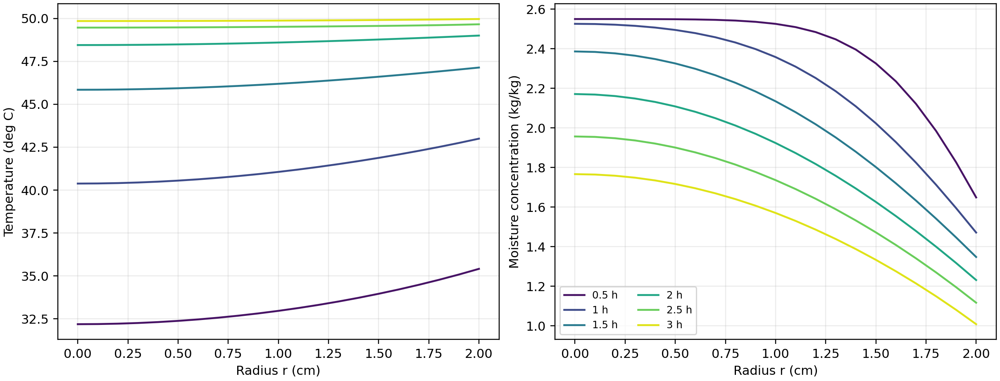
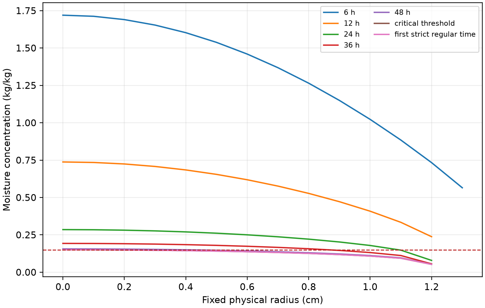

# 变物性与收缩条件下药材烘干的传热传质模型

## 摘要

药材烘干时，热量从表面向内部传递，水分从内部向外迁移。两者的变化速度并不相同。物性变化和几何收缩还会改变干燥终点。我们据此建立圆柱形药材的一维径向传热传质模型，用环形有限体积法和隐式时间积分求解，并用 Richardson 外推核对数值精度。

关于问题一，在固定半径和常热物性条件下，分别求解温度场和含水率场。计算得到 1800 s 时中心、表面温度分别为 33.5753 ℃和 36.7856 ℃，对应含水率分别为 2.5500 kg/kg 和 1.5102 kg/kg。由此可见，预热阶段中心水分变化很小，失水主要集中在表层。

关于问题二，将题设中的物性参数表示为温度和含水率的函数，建立温湿耦合模型。3 h 时中心、表面温度分别为 49.8495 ℃和 49.9664 ℃，含水率分别为 1.7662 kg/kg 和 1.0081 kg/kg。可以看出，此时温度已经接近均匀，但水分仍有明显的径向梯度，升温完成后还需要继续干燥。

关于问题三，以附件 1 最后一小时的环境均值延拓长期边界，并把全域最大含水率低于 0.15 kg/kg 作为干燥完成的判据。固定半径模型的临界时长为 57.4740 h，首个严格达标整分钟为 57.4833 h。在不同长期环境设定下，临界时长约为 57.24—57.83 h，说明结果对环境延拓方式较为敏感。

关于问题四，根据均匀收缩条件下的干物质和水分守恒建立移动边界模型，并用归一化径向坐标把变化区域映射到固定区间。计算得到临界时长为 51.0920 h，首个严格达标整分钟为 51.1000 h。若保持本问物性而固定初始半径，对照时长为 129.8481 h，说明收缩会明显加快本模型中的干燥过程。

最后，对网格、通量平衡和独立程序进行检验，结果均支持上述计算。两类终点的相邻外推值相差约 1 s。所得时长是在一维近似、有效传质边界和经验密度—收缩关系等条件下得到的预测值。

关键词：药材烘干；传热传质；有限体积法；移动边界；干燥终点

<!-- PAGEBREAK -->

## 1 问题重述与分析

### 1.1 任务及数据

题目研究一根长 25 cm、初始半径为 2 cm 的圆柱形药材。烘干开始时，药材温度为 28 ℃，干基含水率为 2.55 kg/kg。附件 1 给出了烘房初期的温度和含湿量，附件 2 给出了药材半径的变化。题目既要求整体干燥情况，也要求指定位置的温度和含水率。我们不能只计算一个平均值，必须描述药材内部的变化 [1]。

四个问题分别考察预热过程、变物性干燥、干燥终点和几何收缩。问题一计算固定半径下 30 min 内的温度和含水率；问题二从题设初值出发，采用附录 3 物性计算全程温湿分布，并列出前三小时结果；问题三沿用问题二模型，确定各处含水率均低于 0.15 kg/kg 的时间；问题四采用附录 4 物性和实测半径，重新计算干燥终点。问题二从初始时刻独立计算，问题三是在此基础上的长期延伸。

### 1.2 模型选择

考虑到题目既要求内部局部分布，又要求全域达标时间，只用平均含水率曲线不能满足要求。我们用 Fourier 导热方程描述传热，用 Fick 有效扩散方程描述水分迁移，再用表面对流边界连接药材和烘房环境。圆柱物料的热质耦合模型 [2] 和非等温移动边界模型 [3] 为建模提供了参考。物性和观测数据均采用题目给定值。

药材长径比为 6.25。我们先忽略中段的轴向差异，只计算半径方向的变化，并将结果看作圆柱中截面的分布。建模时，先处理常物性情形，再考虑物性变化，最后加入实测收缩。问题四直接使用附件给出的半径数据，不再另外拟合收缩方程。

## 2 模型假设与符号

### 2.1 基本假设

（1）药材为径向各向同性的轴对称连续介质，忽略周向差异和中段轴向梯度，以一维径向场近似中截面分布。

（2）第一至第三问半径不变；第四问长度不变、截面均匀径向收缩，整体半径历史适用于所研究的中截面。

（3）初始温度和干基含水率均匀。热物性与扩散率按各问指定附录取局部状态值，不另行拟合参数。

（4）附件 1、附件 2 均作分段线性插值。4 h 后的烘房环境以最后一小时均值为基准平台，末观测之后用 60 s 过渡到平台；这是长期环境假设。

（5）第二至第四问未另给表面系数，故沿用第一问的传热系数 25 W/(m²·K) 和传质系数 8×10⁻⁷ m/s。气相含湿量与固相干基含水率的质量基准不同，在缺少吸附等温线时，将二者之差解释为有效传质推动力。

（6）忽略蒸发潜热、热湿交叉迁移和力学应力，以经验密度和比热的乘积表示有效体积热容。模型按有效介质解释，其质量与热力学闭合限制见第 8.5 节。

（7）第四问干物质无损失、初始干物质体积密度均匀；在均匀收缩下，该干密度只随时间变化。此处的守恒干密度与附录经验密度分开定义，二者的相容性在第 8 节检验。

### 2.2 主要符号

为便于阅读，我们先列出模型的主要状态变量、物性参数和终点时刻。这里的下标 $\infty$ 表示烘房环境，下标 $s$ 表示药材实际表面。

表 2.1 主要状态变量与物性参数说明

| 符号 | 含义 | 单位 |
|---|---|---|
| $t$ | 自烘干起点计的时间 | s |
| $r,R(t),R_0$ | 物理半径、当前表面半径、初始表面半径 | m |
| $\xi=r/R(t)$ | 随材料运动的归一化径向坐标 | 1 |
| $T,T_K$ | 摄氏温度、开尔文温度 | ℃、K |
| $C$ | 固相干基含水率 | kg/kg |
| $T_\infty,C_\infty$ | 烘房温度、环境含湿量 | ℃、kg/kg |
| $\rho,c_p,k$ | 经验密度、比热容、导热系数 | kg/m³、J/(kg·K)、W/(m·K) |
| $D$ | 有效水分扩散率 | m²/s |
| $h_T,h_m$ | 对流传热、有效传质系数 | W/(m²·K)、m/s |
| $\rho_d,v_r$ | 当前干物质体积密度、径向骨架速度 | kg/m³、m/s |
| $t_*,t_{60}$ | 临界时刻、其后首个严格达标整分钟 | s |

### 2.3 离散变量与中间量

在有限体积计算中，同一符号还会带有单元下标或界面下标。为避免将几何量、通量和终点判据混淆，补充说明如表 2.2。

表 2.2 离散计算与诊断中的符号说明

| 符号 | 含义 | 单位 |
|---|---|---|
| $i,N$ | 径向控制体编号、径向控制体总数 | 1 |
| $r_{i-1/2},r_{i+1/2}$ | 第 $i$ 个控制体内、外界面的物理半径 | m |
| $\Delta r$ | 固定半径模型的径向网格间距 | m |
| $V_i,A_{i+1/2}$ | 单位轴向长度下第 $i$ 个控制体体积、外界面面积 | m²、m |
| $u,s,\Gamma$ | 一般守恒式中的传输变量、蓄积系数、输运系数 | 随所取方程而定 |
| $f,f_i,t_i$ | 插值变量、相邻观测点的变量值及其时刻 | 随变量而定、s |
| $z$ | 为保证正性而引入的对数含水率，$z=\ln C$ | 1 |
| $u_{\rm ext}$ | 由两级网格结果作 Richardson 外推后的量 | 与 $u$ 相同 |
| $\bar C$ | 截面面积加权平均干基含水率 | kg/kg |
| $g(t)$ | 全域最大含水率与 0.15 kg/kg 阈值的差 | kg/kg |
| $\mathbf v,\mathbf j_w$ | 骨架速度、水分相对骨架的扩散通量 | m/s、kg/(m²·s) |
| $\rho_{d0},M_d,L$ | 初始干密度、总干物质量和药材长度 | kg/m³、kg、m |
| $\dot R$ | 表面半径对时间的导数 | m/s |

所有计算距离使用 m，表格按题意显示 cm；内部温度保存为 ℃，只在扩散率的 Arrhenius 项中换算为 K。后文的“水分浓度”均指题目定义的干基含水率。至此，后文公式和表格中出现的主要变量均已给出定义。

## 3 数据准备与统一数值方法

### 3.1 数据核验及环境延拓

附件 1 共有 241 组记录，时间范围为 0—14400 s，采样间隔为 60 s；附件 2 共有 145 组记录，时间范围为 0—259200 s，采样间隔为 1800 s。经核对，提取后的两份 CSV 与原始工作簿逐值相同。药材半径由 2.000 cm 逐渐减小到 1.198 cm，计算时直接使用原始观测值，不另用拟合曲线代替。

观测点之间没有直接给出数值。我们先按相邻两点的连线补足中间时刻。设 $f_i,f_{i+1}$ 分别为相邻时刻的环境量或半径，比例插值得

$$
f(t)=f_i+\frac{t-t_i}{t_{i+1}-t_i}(f_{i+1}-f_i),\quad t_i\le t\le t_{i+1}. \qquad (1)
$$

附件 1 只记录了前 4 h 的烘房环境，而问题三、四需要更长时间的环境条件。我们取最后一小时 61 个观测点的均值作为后续环境平台。该时段温度和含湿量的均值分别为 49.998934 ℃和 0.04998754 kg/kg，标准差分别为 0.154353 ℃和 0.00015013 kg/kg；相应线性趋势约为 0.002824 ℃/h 和 −0.00001288 kg/(kg·h)。可以看到，该时段波动较小。至此，模型中的环境参数取值已知，可以用于后续计算。第 8.3 节再比较不同延拓方法对结果的影响。

### 3.2 环形有限体积离散

为计算温度和含水率在半径方向上的变化，我们把药材截面划分为若干同心圆环。省略各单元共有的轴向长度后，第 $i$ 个控制体的体积为 $V_i=\pi(r_{i+1/2}^2-r_{i-1/2}^2)$，外侧面积为 $A_{i+1/2}=2\pi r_{i+1/2}$。对每个圆环，先写“单元内累积量 = 外侧流入量 − 内侧流出量”。设 $u$ 为传输变量，$s$ 为蓄积系数，$\Gamma$ 为输运系数，就得到

$$
s_iV_i\frac{\mathrm du_i}{\mathrm dt}=A_{i+1/2}\Gamma_{i+1/2}\frac{u_{i+1}-u_i}{\Delta r}-A_{i-1/2}\Gamma_{i-1/2}\frac{u_i-u_{i-1}}{\Delta r}. \qquad (2)
$$

式（2）左侧是圆环内变量的变化，右侧是两个界面的净通量。温度方程取 $u=T,s=\rho c_p,\Gamma=k$；水分方程取 $u=C,s=1,\Gamma=D$。相邻单元的物性不同，我们用调和平均计算界面系数：

$$
\Gamma_{i+1/2}=\frac{2\Gamma_i\Gamma_{i+1}}{\Gamma_i+\Gamma_{i+1}}. \qquad (3)
$$

圆心控制体的内侧面积为零，因此可满足 $r=0$ 处的对称条件；最外层控制体采用题设的 Robin 边界。相邻控制体之间的通量大小相等、方向相反，所有单元求和后只保留表面通量，后文据此检验水分平衡。

### 3.3 时间积分、正性与外推

空间离散后，偏微分方程变为常微分方程组。我们用后向差分公式（BDF）推进时间。为避免出现负含水率，先令 $z=\ln C$，按 $z_t=C_t/C$ 计算，再由 $C=\exp z$ 还原含水率。积分器自动调整步长，并在题目要求的时刻输出结果。

为减小空间离散误差，我们在相同物理输出节点上计算 $N$ 和 $2N$ 两套网格。若误差主项近似与网格步长的平方成正比，两式相消后可得到二阶 Richardson 外推：

$$
u_{\rm ext}=\frac{4u_{2N}-u_N}{3}. \qquad (4)
$$

问题一采用 5120/10240 两级网格，问题二、三采用 2560/5120 两级网格，问题四采用 640/1280 两级网格。计算结果先按式（4）外推，再按题意保留四位小数。问题二每 600 s 分段计算，段与段之间传递未舍入的节点值。

## 4 问题一：固定半径预热模型

### 4.1 方程、初值与边界

问题一先不考虑收缩，计算区域固定为 $0<r<R_0=0.02$ m。热量守恒给出导热方程；水分守恒并取有效扩散通量后给出扩散方程。因此我们采用

$$
\rho c_p\frac{\partial T}{\partial t}=\frac1r\frac{\partial}{\partial r}\left(rk\frac{\partial T}{\partial r}\right),\qquad \frac{\partial C}{\partial t}=\frac1r\frac{\partial}{\partial r}\left(rD(C)\frac{\partial C}{\partial r}\right). \qquad (5)
$$

附录 2 直接给出 $\rho=820$ kg/m³、$c_p=2600$ J/(kg·K)、$k=0.36$ W/(m·K)。水分扩散率随含水率变化，按题设关系取

$$
D(C)=7\times10^{-9}\exp\left(-\frac{0.89}{C}\right)\quad\mathrm{m^2/s}. \qquad (6)
$$

烘干刚开始时，内部温度和含水率均匀，故取 $T(r,0)=28$ ℃、$C(r,0)=2.55$ kg/kg。圆心两侧完全对称，故 $T_r(0,t)=C_r(0,t)=0$。在表面，传导或扩散通量应等于与空气的对流交换通量。径向向外取正，于是边界条件为

$$
-kT_r(R_0,t)=h_T[T_s-T_\infty(t)],\qquad -DC_r(R_0,t)=h_m[C_s-C_\infty(t)]. \qquad (7)
$$

由式（7）可知，当烘房温度高于药材表面温度时，热量由环境进入药材；当表面含水率高于环境有效含湿量时，水分由药材向外迁移。问题一中的热物性为常数，扩散率也不随温度变化，因此温度方程和水分方程可以分别求解。

### 4.2 指定位置的计算结果

将附件 1 的环境数据逐时刻代入上述模型，我们得到表 1、表 2。表中列出题目指定时刻和位置的结果。完整的 1—1800 s 温度场和含水率场保存在支撑材料 result1.xlsx 中，径向间隔为 0.1 cm，表中结果按题意保留四位小数。

{{TABLE1}}

{{TABLE2}}


由图 1 可以看到，空间分布上温度从表面向中心逐渐降低；相同时刻，含水率从中心向表面逐渐降低。1800 s 时，表面与中心的温差为 3.2103 ℃；表面含水率已经降至 1.5102 kg/kg，中心含水率仍接近初值。我们据此判断，预热阶段温度传播快于内部水分迁移，药材表层先出现明显失水。

## 5 问题二：变物性温湿耦合模型

### 5.1 经验物性与耦合关系

问题二从烘干初始时刻重新计算。我们不再把物性看成常数，而是直接采用附录 3 给出的含水率关系 [1]：

$$
\rho=650+128C,\qquad c_p=1450+2736\frac{C}{C+1},\qquad k=0.21+0.38\frac{C}{C+1}. \qquad (8)
$$

$$
D(C,T)=2.4\times10^{-3}\exp\left(-\frac{0.45}{C}\right)\exp\left(-\frac{3850}{T_K}\right),\qquad T_K=T+273.15. \qquad (9)
$$

式（8）给出热方程所需的密度、比热和导热系数；式（9）给出水分方程所需的扩散率。把它们逐个代入式（5），再保留原初值和式（7）的边界条件，就得到问题二模型。含水率变化会改变密度、比热和导热系数。温度又会通过扩散率影响水分迁移。因此我们同时求解温度和含水率。计算 Arrhenius 项时，将摄氏温度换算为开尔文温度。至此，模型中的物性参数取值已知，可以用于计算温湿分布。

这里将水分迁移看作固定骨架中的有效扩散，并用经验量 $\rho(C)c_p(C)$ 表示体积热容。第 8.5 节会说明，若把 $\rho(C)/(1+C)$ 直接作为守恒干物质密度使用，则会与收缩关系不一致。

### 5.2 前三小时结果与全程输出

{{TABLE3}}

{{TABLE4}}



从表 3、表 4 和图 2 可以看到，空间分布上温度曲线已接近平坦，而含水率曲线仍由中心向表面明显下降。3 h 时中心与表面的温差只有 0.1169 ℃；含水率仍相差 0.7581 kg/kg，且各处都没有达到 0.15 kg/kg。随着表层含水率降低，扩散率继续减小，内部水分向外迁移还需要较长时间。我们因此不能把表面温度稳定作为烘干完成的依据。

表 3、表 4 给出了前三小时的计算结果。全程温湿场按 1 s 时间间隔、0.1 cm 径向间隔输出，并一直计算到问题三的首个严格达标整分钟。长期环境按第 3.1 节处理，具体输出和跨问题核对方式见附录 A.2。

## 6 问题三：固定半径的干燥终点

### 6.1 全域阈值与严格不等式

问题三要求药材各处的含水率都低于 0.15 kg/kg。我们先在每一时刻找出全部径向节点中的最大值，再用该最大值和阈值的差定义判别函数：

$$
g(t)=\max_{0\le r\le R_0}C(r,t)-0.15,\qquad t_* =\inf\{t:g(t)<0\}. \qquad (10)
$$

式（10）中，$g(t)$ 表示最湿位置与阈值的差；$t_*$ 是这个差首次变为负数的时刻。这样做保证了我们没有遗漏较湿的内部位置。计算结果表明，中心位置的含水率最高，所以干燥终点由中心位置决定。在临界时刻有 $g(t_*)=0$，其后的时刻才严格低于阈值。

为确定终点，我们在阈值两侧对各径向位置的未舍入含水率作时间插值，取最晚达到阈值的位置。若设备只能按整分钟停止，就要把临界时刻向后推到下一个整分钟。因此

$$
t_{60}=60\left(\left\lfloor\frac{t_*}{60}\right\rfloor+1\right). \qquad (11)
$$

### 6.2 时长与指定结果

{{ENDPOINT3}}

{{TABLE5}}

表 5 最后一行给出了临界时刻的含水率。此时中心显示为 0.1500，恰好位于阈值边界。按式（11）计算，下一整分钟才严格满足题目要求。完整工作簿同时保留了分钟序列、临界行和首个严格达标整分钟行。


由图 3 可以看到，三条曲线从表面到中心依次上移，表面含水率下降最快，中心下降最慢。进入干燥后期后，各位置的变化都逐渐变缓。因此，只判断表面或平均含水率会提前结束烘干。我们必须以全域最大值作为终点判据。上述时长是在第 3.1 节长期环境假设下得到的，其敏感性将在第 8.3 节分析。

## 7 问题四：收缩移动边界模型

### 7.1 从干物质与水分守恒出发

问题四中药材半径随时间变化。附件 2 已经给出 $R(t)$，我们直接把实测半径代入模型。在均匀径向收缩、长度不变的条件下，离中心越远的材料移动越快，故材料速度为 $v_r=(\dot R/R)r$。设当前干物质体积密度为 $\rho_d$，相对骨架的水分通量为 $\mathbf j_w$。先对干物质和水分分别写守恒关系，得到

$$
\partial_t\rho_d+\nabla\cdot(\rho_d\mathbf v)=0,\qquad \partial_t(\rho_d C)+\nabla\cdot(\rho_d C\mathbf v+\mathbf j_w)=0. \qquad (12)
$$

第一式表示干物质没有生成或损失；第二式表示水分随骨架运动，还会相对骨架扩散。我们取有效 Fick 通量 $\mathbf j_w=-\rho_dD\nabla C$，再用第一式消去第二式中的干物质连续项，得到

$$
\frac{\mathrm DC}{\mathrm Dt}=\frac1{\rho_d}\nabla\cdot(\rho_dD\nabla C). \qquad (13)
$$

初始干密度均匀，截面又作均匀径向收缩。单位长度的截面积正比于 $R(t)^2$，所以干物质守恒给出 $\rho_d(t)R(t)^2=\rho_{d0}R_0^2$。此时干密度只随时间变化，式（13）右侧的 $\rho_d$ 可以约去。将材料导数展开为 $\mathrm DC/\mathrm Dt=\partial C/\partial t+v_r\partial C/\partial r$，便得到

$$
\frac{\partial C}{\partial t}+\frac{\dot R}{R}r\frac{\partial C}{\partial r}=\frac1r\frac{\partial}{\partial r}\left(rD\frac{\partial C}{\partial r}\right). \qquad (14)
$$

式（14）中的 $C$ 是单位干物质量所含的水分，几何收缩已经通过骨架运动和干物质守恒体现，因此不需要再加入体积压缩源项。

### 7.2 固定域坐标与表面通量

实际区域的边界不断移动，直接离散会反复改变网格。我们令 $\xi=r/R(t)$，把收缩区域变换到固定区间 $0<\xi<1$。固定 $\xi$ 的网格速度与骨架速度相同，因此坐标变换项与式（14）中的对流项相互抵消。再按 $\partial/\partial r=R^{-1}\partial/\partial\xi$ 变换两个径向导数，就得到

$$
\rho(C)c_p(C)\left.\frac{\partial T}{\partial t}\right|_\xi=\frac1{R(t)^2\xi}\frac{\partial}{\partial\xi}\left(\xi k(C)\frac{\partial T}{\partial\xi}\right). \qquad (15)
$$

$$
\left.\frac{\partial C}{\partial t}\right|_\xi=\frac1{R(t)^2\xi}\frac{\partial}{\partial\xi}\left(\xi D(C,T)\frac{\partial C}{\partial\xi}\right). \qquad (16)
$$

式（15）来自热传导方程的同一坐标变换，式（16）来自式（14）的坐标变换。热方程仍采用有效热容近似，不计变形功和相变热。圆心满足对称条件 $T_\xi=C_\xi=0$。表面仍满足“内部通量 = 与空气的对流通量”，而 $r$ 导数换成 $\xi$ 导数后多出 $1/R$，所以实际表面的边界条件为

$$
-\frac{k}{R}T_\xi(1,t)=h_T(T_s-T_\infty),\qquad -\frac{D}{R}C_\xi(1,t)=h_m(C_s-C_\infty). \qquad (17)
$$

由式（15）—（17）可知，内部扩散项随 $R^{-2}$ 变化，表面通量随 $R^{-1}$ 变化。随着半径减小，内部传递距离变短，因此收缩会影响干燥速度。

附录 4 的局部物性为

$$
\rho=760+90C,\qquad c_p=1850+2150\frac{C}{C+1},\qquad k=0.12+0.20\frac{C}{C+1}. \qquad (18)
$$

$$
D(C,T)=4.2\times10^{-4}\exp\left(-\frac{0.30}{C}\right)\exp\left(-\frac{3850}{T_K}\right). \qquad (19)
$$

### 7.3 固定物理位置的映射与结果

题目要求给出固定位置的含水率。因此每个时刻我们先用 $\xi=r/R(t)$ 找到相应的计算位置，再读取该处结果。当 $r>R(t)$ 时，该位置已经在药材之外，工作簿中的单元格留空；“药材表面”一列始终取 $\xi=1$，随边界移动。

{{ENDPOINT4}}

{{TABLE6}}

由附件 2 可知，6 h 时药材半径已经减小到 1.374 cm，此后还将继续减小。可以看到，在表 6 所列时刻，距中心 1.5 cm 和 2 cm 的位置均已位于药材之外。我们只列出 0、0.5、1 cm 和实际表面。完整的 result4.xlsx 仍保留所有间隔为 0.1 cm 的固定位置，并用空白表示实体外位置。




问题三和问题四的临界时长相差约 6.38 h，但两问同时改变了物性和几何条件。为单独考察收缩的影响，第 8.4 节保持附录 4 物性不变，只把半径固定为初始值进行对照。

## 8 模型检验与灵敏度分析

### 8.1 网格与程序一致性

我们先加密空间网格。第一问两级网格在全部输出节点的最大温度和含水率差分别约为 1.03×10⁻⁶ ℃和 4.57×10⁻⁶ kg/kg；第二问前三小时的最大差分别约为 8.14×10⁻⁷ ℃和 1.49×10⁻⁵ kg/kg。可以看到，网格加密后结果变化很小。因此我们取式（4）的外推值作为最终计算结果。

表 7 两类终点的空间加密结果

| 模型 | 径向区间或外推组合 | 临界时长/h |
|---|---|---:|
| 第三问 | 1280 | 57.4881201 |
| 第三问 | 2560 | 57.4772860 |
| 第三问 | 5120 | 57.4747882 |
| 第三问 | 2560/5120 外推 | 57.4739569 |
| 第四问 | 640 | 51.0996704 |
| 第四问 | 1280 | 51.0938837 |
| 第四问 | 640/1280 外推 | 51.0919548 |

由表 7 可知，第三、四问相邻外推组合的终点差分别约为 1.02 s 和 0.98 s。第四问再用单元中心有限体积程序独立计算，1600/3200 单元外推得到 51.0919474 h，表 6 的代表时刻结果与主程序保留四位小数后的结果一致。由此可见，数值计算结果较为稳定。由于观测收敛阶低于 2，外推差只作为误差量级参考。

此外，程序还检验了平衡场保持、边界通量方向、固定半径退化和阈值插值等情况，95 项自动化测试均通过。表 1—6 与数值输出一致，工作簿回读和跨问题比较见附录 A.2。

### 8.2 水分通量平衡

为检查程序有没有漏掉水分，我们再对水分通量作平衡核验。固定半径下，把水分方程在截面上积分，并代入表面边界条件，截面平均含水率满足

$$
\bar C(t)-\bar C(0)=-\frac{2h_m}{R_0}\int_0^t[C_s(\tau)-C_\infty(\tau)]\,\mathrm d\tau. \qquad (20)
$$

移动域中，面积权重变为 $2\xi$，故定义 $\bar C=2\int_0^1 C\xi\,\mathrm d\xi$。把式（16）在 $0\leq\xi\leq1$ 上积分，再代入式（17），得到

$$
\frac{\mathrm d\bar C}{\mathrm dt}=-\frac{2h_m}{R(t)}[C_s(t)-C_\infty(t)]. \qquad (21)
$$

我们利用前 600 s 的逐秒输出和后续分钟输出，对边界通量进行积分。第三问两级网格的相对最大残差约为 1.21×10⁻⁶，第四问分别约为 1.61×10⁻⁶ 和 1.69×10⁻⁶。残差很小，说明计算结果满足模型中的水分通量平衡。

### 8.3 长期环境与表面系数情景

表 8 第三问长期平台敏感性（同为 640 区间）

| 4 h 后环境设定 | 临界时长/h |
|---|---:|
| 最后一小时均值 | 57.5413 |
| 最后半小时均值 | 57.5151 |
| 最后观测值保持 | 57.2375 |
| 温度降低、含湿量升高各一个尾段标准差 | 57.8259 |
| 温度升高、含湿量降低各一个尾段标准差 | 57.2587 |

表 8 中各情景采用相同网格，临界时长相差约 0.59 h，明显大于相邻网格外推的差异。可以看出，长期环境设定对终点的影响较大。表中数值是指定情景下的计算结果，不表示统计置信区间。

表 9 第四问表面系数敏感性（同为 320 区间）

| 变化系数 | 基准的 0.8 倍/h | 基准/h | 基准的 1.2 倍/h |
|---|---:|---:|---:|
| 传质系数 | 51.8009 | 51.1236 | 50.7400 |
| 传热系数 | 51.1418 | 51.1236 | 51.1117 |

由表 9 可以看出，在给定取值范围内，传质系数变化引起的终点偏移明显大于传热系数变化的影响。这说明干燥后期主要受水分迁移控制。0.8 倍和 1.2 倍只是设定的扰动幅度，实际参数还需要实验标定。

### 8.4 收缩处理与固定几何对照

首先保持附件 2 的观测点不变，将分段线性插值改为单调 PCHIP。320 区间计算得到的终点提前约 12.603 s。再把半径观测时刻统一提前或推后 15 min，终点相对同组基准分别改变约 −0.135 h 和 +0.137 h。这两种计算分别考察插值方法和观测时刻的影响。

在附录 4 物性不变、半径固定为 $R=R_0$ 的对照模型中，640/1280 区间外推终点为 129.8481 h，而实测收缩模型约为 51.0920 h。半径减小会同时改变式（16）的内部扩散尺度和式（17）的表面尺度，因此对水分迁移影响很大。该对照只用于考察模型中的几何因素，不是对真实收缩效应的独立实验测量。

### 8.5 密度与收缩的相容性

为检验密度关系与收缩假设是否相容，我们暂时把附录 4 的 $\rho(C)$ 看作当前真实湿基密度。干基含水率为 $C$ 时，湿质量是干物质量的 $1+C$ 倍，因此有 $\rho_d=\rho(C)/(1+C)$。再把干密度在当前截面上积分，总干物质量为

$$
M_d(t)=2\pi L R(t)^2\int_0^1\frac{760+90C(\xi,t)}{1+C(\xi,t)}\xi\,\mathrm d\xi. \qquad (22)
$$

我们将非均匀含水率场代入式（22）积分。在 1280 区间的临界时刻得到 $M_d(t_*)/M_d(0)\approx0.890289$，偏差约为 10.97%。这说明，若把给定密度看作真实湿基密度，长度不变的实测收缩与干物质守恒不能同时严格成立。该偏差用于检验模型关系，并不表示药材实际损失了相同比例的干物质。

我们在热方程中用附录密度表示经验有效体积热容，在水分方程中按均匀收缩假设确定干密度。这样可以得到当前题设下的有效模型，但密度与几何关系的不相容仍是模型限制。要建立更严格的多组分守恒模型，还需要孔隙率、局部变形或长度变化等数据，现有附件无法确定这些关系。

## 9 模型评价与结论

### 9.1 模型优点

我们用统一的有限体积方法处理常物性、变物性和实测收缩三种情况，得到题设位置的温度和含水率，并以全域最大含水率确定干燥终点。问题四采用移动坐标后，我们可以在固定计算区间内处理收缩边界，同时区分实际表面和固定位置。网格加密、通量平衡和独立程序复算均支持计算结果。

### 9.2 模型缺点及改进方向

模型还有以下不足：一维中截面近似没有考虑端面影响；长期环境由前 4 h 观测延拓得到；气固边界采用有效浓度差并沿用题设表面系数；模型没有计入潜热，经验密度与收缩关系也未严格闭合。现有检验说明数值求解相互一致，物理预测精度仍需要内部含水率观测验证。

后续可补充长期烘房记录和内部温湿度测量，用于检验环境平台和干燥终点；再结合二维模型、吸附平衡关系和几何变形观测，进一步分析端面效应和质量闭合对结果的影响。

### 9.3 结论

综合四个问题的结果我们可以看到，药材先在表层快速失水，随后内部水分缓慢向外迁移；即使温度已经接近均匀，含水率仍可能高于阈值。在上述假设下，固定半径模型和实测收缩模型的临界时长分别为 57.4740 h 和 51.0920 h；若按整分钟停止，则分别取 57.4833 h 和 51.1000 h。相同物性下的固定几何对照说明，收缩是影响预测时长的重要因素。实际应用时，还需要结合长期环境记录和内部含水率测量进行校验。

## AI 工具使用声明

本参赛队在竞赛过程中使用了AI工具，主要用于模型推导辅助、代码实现与调试、数值复算和结果核查、论文初稿组织及语言润色，详细使用情况见支撑材料。

参赛队对模型、代码、数值、参考文献和最终表述承担核验责任。工具的具体用途与核验方式见支撑材料中的《AI 工具使用详情.pdf》，本节披露不作为参考文献引用。

## 参考文献

[1] 全国大学生数学建模竞赛组委会. 2026 年高教社杯全国大学生数学建模竞赛 A 题：药材的烘干问题及附件[Z]. 2026.

[2] DA SILVA W P, E SILVA C M D P S, GAMA F J A. Estimation of thermo-physical properties of products with cylindrical shape during drying: The coupling between mass and heat[J]. Journal of Food Engineering, 2014, 141: 65-73. DOI: 10.1016/j.jfoodeng.2014.05.010.

[3] ADROVER A, VENDITTI C, BRASIELLO A. A non-isothermal moving-boundary model for continuous and intermittent drying of pears[J]. Foods, 2020, 9(11): 1577. DOI: 10.3390/foods9111577.

<!-- APPENDIX -->

## 附录 A 支撑材料与复现说明

支撑材料 ZIP 内的文件列表如下。论文电子版从摘要页开始，不含承诺书和编号专用页。文中四位小数用于题设输出，终点判定始终使用未舍入结果。

{{FILELIST}}

### A.1 运行顺序

先在支撑材料根目录安装 requirements.txt 中的依赖。Python 版本须为 3.11 或以上。支撑材料采用单层结构，按下面顺序运行即可：

```powershell
python -m pip install -r requirements.txt
python run_problem1.py
python run_problem2.py
python run_problem3.py
python run_problem4.py
```

四个求解脚本在根目录产生 problem1_result.json 至 problem4_result.json，并生成相应图形；不会覆盖已填写的四份结果工作簿。复现所需 CSV 已包含在支撑材料中。

若仅需查看全程第二问 Excel，无须重新求解，在支撑材料根目录执行 python restore_full_result2.py，即可由压缩数组还原 result2_full_process.xlsx。

### A.2 全程输出与数值核验记录

第二问全程逐秒 Excel 约 27.7 MB。为满足支撑材料压缩包不超过 20 MB 的要求，包中以 result2_full_process.npz 无损保存四位小数交付值，并附 Excel 恢复脚本；result2.xlsx 为原前三小时文件。包外另提供的全程 Excel 与恢复文件的两张工作表 XML 逐字节相同。

全程积分沿用第二问的方程、初值和完整节点终态，输出不由舍入后的分钟值插值得到。其前 3 h 与原第二问交付值完全一致，与第三问独立分钟积分的最大四位小数差为 0.0001 kg/kg，差异来自积分分段与舍入边界。

原四份工作簿共回读 700974 个单元格，题设表 1—6 与对应数值输出一致；第二、三问原始分钟序列在前三小时重叠的 3780 个含水率值相同。第二问全程逐秒工作簿另有独立回读记录，见 problem2_full_process_audit.json。

支撑材料根目录保存原四问审计、第四问敏感性和密度诊断、全程逐秒结果审计。程序核验与参赛队人工审查是两类不同记录；AI 工具使用详情仅记录可确认的自动检查，不代替或虚构人工核验。

## 附录 B 核心源程序

下列仅列出问题一至问题四的核心模型代码。运行入口、独立验证、测试程序和工作簿工具等完整源码均直接放在支撑材料根目录，附录不重复展开。附录页数不计入正文限制。

{{SOURCECODE}}
