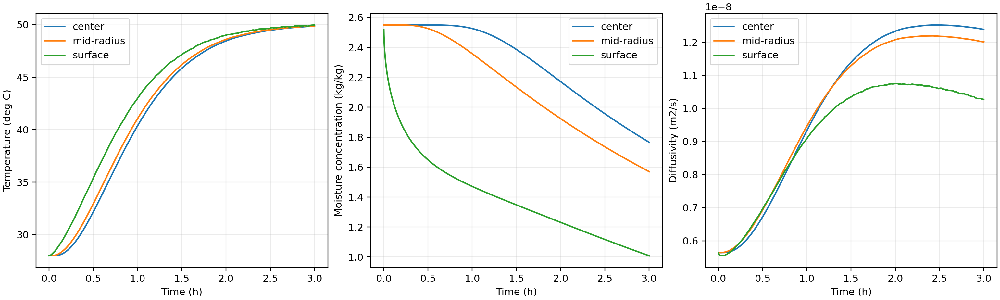

# 第二问：变物性温湿耦合模型

## 1. 与第一问的关系

第二问按题意从烘干起点统一采用附录 3 物性。它不是“先用第一问算到 1800 s，再切换系数”的分段模型：两问分别对应不同的经验物性假设，因此同一时刻的温湿结果可以不同。初始温度和干基含水率仍为 28 °C、2.55 kg/kg，半径固定为 2 cm，长度为 25 cm。

沿用一维轴对称中段近似，忽略轴向变化及端面效应。附件 1 给定的烘房历史按相邻记录线性插值。第二问的表面系数没有新给值，故假定沿用第一问的 \(h_T=25\ \mathrm{W/(m^2K)}\)、\(h_m=8\times10^{-7}\ \mathrm{m/s}\)。气相含湿量和固相干基含水率的质量基准不同，本题缺少吸附等温线，因此二者之差只作为有效传质推动力。

## 2. 控制方程

在 \(0<r<R=0.02\ \mathrm m\) 内，采用

\[
\rho(C)c_p(C)\frac{\partial T}{\partial t}
=\frac1r\frac{\partial}{\partial r}\left[rk(C)\frac{\partial T}{\partial r}\right],
\qquad
\frac{\partial C}{\partial t}
=\frac1r\frac{\partial}{\partial r}\left[rD(C,T)\frac{\partial C}{\partial r}\right].
\]

附录 3 物性逐式为

\[
\rho=650+128C,\qquad c_p=1450+2736\frac{C}{C+1},
\qquad k=0.21+0.38\frac{C}{C+1},
\]
\[
D=2.4\times10^{-3}\exp(-0.45/C)\exp(-3850/T_K),
\qquad T_K=T_{\circ C}+273.15.
\]

中心满足 \(T_r=C_r=0\)，表面满足

\[
-kT_r(R,t)=h_T(T_s-T_\infty),\qquad
-DC_r(R,t)=h_m(C_s-C_\infty).
\]

温度通过 \(D(C,T)\) 改变水分迁移，含水率通过 \(\rho,c_p,k\) 改变温度演化，因此两场联立积分。这里的 \(\rho c_p\) 用作题给经验体积热容；水分方程是在固定骨架、均匀干物质量密度假设下对干基含水率的有效方程。不能另把 \(\rho(C)/(1+C)\) 强制视为同一守恒干密度，否则静止且不收缩的干骨架会与变化的经验湿密度冲突。当前模型不声称是严格的多组分质量—能量联合闭合。

## 3. 数值方法与输出时段

径向使用守恒节点型环形有限体积，界面系数取调和平均；以 \(T,\log C\) 联立进行 BDF 积分。正式计算采用 2560/5120 径向区间，在相同输出位置作二阶 Richardson 外推；相对容差为 \(2\times10^{-10}\)，最大时间步长为 2 s。按 600 s 分段积分并传递全部节点终态，以控制内存；分段续算与一次性积分的一致性有自动化测试。

题面要求建立“整个烘干过程”的模型，同时表 3、表 4 明确列出前三小时。本问工作簿以该表格时段为输出范围，保存 1–10800 s 的逐秒场，半径为 0–2 cm、步长 0.1 cm。原始模板仅为 5 行、6 列示例，没有规定总行数，因此“完整结果”是否必须延续到终点存在解释空间，不能以模板支持前三小时这一口径。该模型可继续积分，第三问使用相同方程从同一初值计算到阈值终点；不能将 3 h 说成已经完成干燥。

## 4. 计算结果

**表 3　3 小时内药材温度（°C）**

| 时间/h | 0 cm | 0.5 cm | 1.0 cm | 1.5 cm | 2.0 cm |
|---:|---:|---:|---:|---:|---:|
| 0.5 | 32.1892 | 32.3821 | 32.9659 | 33.9608 | 35.4130 |
| 1.0 | 40.3816 | 40.5536 | 41.0605 | 41.8782 | 42.9976 |
| 1.5 | 45.8468 | 45.9348 | 46.1930 | 46.6051 | 47.1400 |
| 2.0 | 48.4502 | 48.4881 | 48.5984 | 48.7736 | 49.0033 |
| 2.5 | 49.4670 | 49.4792 | 49.5136 | 49.5653 | 49.6609 |
| 3.0 | 49.8495 | 49.8553 | 49.8746 | 49.9101 | 49.9664 |

**表 4　3 小时内药材水分浓度（kg/kg）**

| 时间/h | 0 cm | 0.5 cm | 1.0 cm | 1.5 cm | 2.0 cm |
|---:|---:|---:|---:|---:|---:|
| 0.5 | 2.5499 | 2.5489 | 2.5256 | 2.3257 | 1.6486 |
| 1.0 | 2.5257 | 2.4948 | 2.3578 | 2.0230 | 1.4711 |
| 1.5 | 2.3861 | 2.3256 | 2.1344 | 1.8020 | 1.3476 |
| 2.0 | 2.1709 | 2.1084 | 1.9236 | 1.6259 | 1.2311 |
| 2.5 | 1.9566 | 1.9006 | 1.7360 | 1.4720 | 1.1166 |
| 3.0 | 1.7662 | 1.7165 | 1.5702 | 1.3333 | 1.0081 |

3 h 时，表面温度为 49.9664 °C，中心为 49.8495 °C，温度场已经接近均匀；但中心和表面含水率仍为 1.7662、1.0081 kg/kg，均远大于 0.15，热平衡并不代表干燥完成。

## 5. 验证与局限

最终复算中，2560/5120 网格在完整 10800×21 个位置上的最大直接差为温度 \(8.14184\times10^{-7}\) °C、含水率 \(1.49374\times10^{-5}\) kg/kg；两级直接值分别有 32 个温度和 32 个含水率单元发生四位小数舍入翻转，因此正式表使用外推结果。第一秒表面含水率为 2.5198 kg/kg。两个工作表各为 10801 行、22 列。

材料公式、Kelvin 换算、均匀平衡、热干边界方向、固定参数退化到第一问、阈值事件与断点续算均有测试。完整工作簿与本次重新生成的数值载荷逐单元格相同，见 [最终审查记录](final-review.md) 和 [机器审计](data/final_all_questions_audit.json)。

一维近似的轴向误差、气固平衡关系及经验密度的严格物理闭合尚未独立验证；不能由网格收敛推断这些假设没有误差。第三问需要的长期环境延拓也是单独的模型假设。

## 来源与 AI 使用说明

公式和数据来自用户提供的 A 题 PDF 第 1–4 页、附件 1 和结果模板；模型选择文献见 [文献对比](../docs/literature-review.md)，逐式审计见 [第二问公式复核](../docs/problem2-formula-audit.md)。本节由 OpenAI Codex 协助计算、核对和起草，参赛作者仍需审定最终模型解释与提交材料；研究技能软件引用保留于 [第四问参考文献 5](problem4.md#参考文献)。
