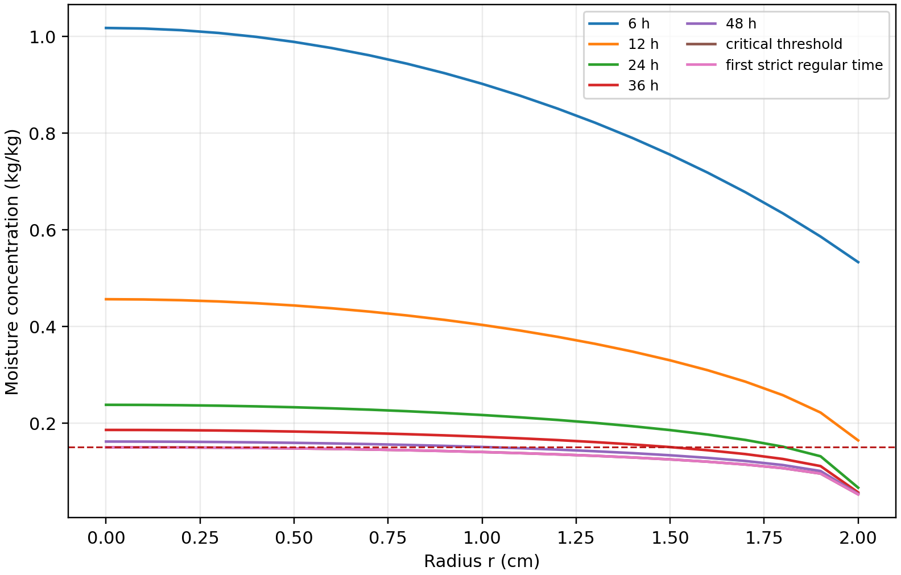

# 第三问：固定半径药材的干燥终点

## 1. 模型与终点定义

本问沿用 [第二问](problem2.md) 的固定半径温湿耦合方程、附录 3 物性、初值与有效表面边界，继续计算长期干燥。第二问与第三问的前 3 h 应对应同一个连续模型；第三问不在 3 h 重置初值，也不把第二问工作簿中的四位小数值作为续算初场。

定义

\[
g(t)=\max_{0\le r\le0.02}C(r,t)-0.15,
\qquad t_* = \inf\{t:g(t)<0\}.
\]

在本算例连续下降的终点邻域，临界时刻满足 \(g(t_*)=0\)，严格小于在其后成立。因此分别报告临界时刻和其后第一个严格达标的整分钟时刻。判断使用未舍入场，不能只看 Excel 中四位小数显示的 0.1500。

## 2. 烘房边界的延拓假设

附件 1 仅覆盖 0–14400 s，即前 4 h；无法直接唯一确定约两天后的边界。基准方案取最后 1 h 的 61 个观测值的算术均值：温度 49.998934 °C，环境含湿量 0.04998754 kg/kg。末观测后用 60 s 线性过渡到均值，再保持常数。

最后 1 h 的观测标准差分别为 0.154353 °C、0.00015013 kg/kg，线性趋势约为 0.002824 °C/h、-0.00001288 kg/(kg·h)。这些描述统计支持“尾段近似平台”的建模选择，但不能证明未来两天的环境必然保持不变。

## 3. 求解与验证

采用圆柱节点型有限体积、调和平均界面系数和 \(T,\log C\) 的 BDF 联立积分。先在 2560、5120 径向区间定位全域最大含水率事件，再在共同输出时刻作二阶 Richardson 外推，最后从未舍入的外推场重新定位临界时刻。采用相对容差 \(2\times10^{-9}\)、最大时间步长 60 s；前 600 s 加密输出至 1 s 用于通量积分诊断。

各位置分别在临界括区内作时间插值，以最后一个达到阈值的位置确定全域临界时刻，避免“最湿位置改变”时直接插值两个最大值产生错误。本题计算中保存的径向场向外非增，最大值位于中心。

| 径向区间数 | 临界时刻/s | 临界时刻/h |
|---:|---:|---:|
| 1280 | 206957.232419 | 57.4881201 |
| 2560 | 206918.229592 | 57.4772860 |
| 5120 | 206909.237679 | 57.4747882 |
| 2560/5120 外推并重新定位 | 206906.244663 | 57.4739569 |

1280/2560 与 2560/5120 外推相差约 1.02 s；该差值是空间误差量级参考，不是严格数学上界。此前在 1280 网格加严时间设置至 \(2\times10^{-10}\)、30 s，终点仅变化约 \(1.9\times10^{-5}\) s。前者记录和复现口径见 [公式审计](../docs/problem3-formula-audit.md)。

2560/5120 网格下，截面平均含水率变化与 Robin 表面通量积分的相对最大残差分别约 \(1.20770\times10^{-6}\)、\(1.20846\times10^{-6}\)。该检验针对当前有效水分方程；不会自动证明经验密度、气固平衡或轴向简化的物理准确性。

## 4. 结果

临界时长为 **57.4740 h**。按整分钟停止时，取 **206940 s，即约 57.4833 h**。该时刻未舍入的最大含水率为 0.1499901682 kg/kg，严格低于阈值。

**表 5　药材烘干过程的水分浓度（kg/kg）**

| 时间/h | 0 cm | 0.5 cm | 1.0 cm | 1.5 cm | 2.0 cm |
|---:|---:|---:|---:|---:|---:|
| 6 | 1.0170 | 0.9881 | 0.9015 | 0.7550 | 0.5328 |
| 12 | 0.4561 | 0.4432 | 0.4031 | 0.3297 | 0.1642 |
| 18 | 0.2988 | 0.2916 | 0.2687 | 0.2253 | 0.0845 |
| 24 | 0.2378 | 0.2327 | 0.2167 | 0.1855 | 0.0665 |
| 30 | 0.2058 | 0.2018 | 0.1892 | 0.1641 | 0.0598 |
| 36 | 0.1859 | 0.1825 | 0.1718 | 0.1504 | 0.0566 |
| 42 | 0.1721 | 0.1691 | 0.1597 | 0.1407 | 0.0548 |
| 48 | 0.1618 | 0.1592 | 0.1507 | 0.1334 | 0.0537 |
| 54 | 0.1539 | 0.1514 | 0.1436 | 0.1277 | 0.0530 |
| 临界终点 57.4740 | 0.1500 | 0.1477 | 0.1402 | 0.1249 | 0.0526 |

工作簿包含 3449 个整分钟数据行、一行精确临界时刻和表头，共 3451 行、22 列。实际四位小数浓度与临界/严格时刻的未舍入判断分开保存。

## 5. 边界敏感性与解释

各方案统一在 640 网格计算，相对同组基准比较。

| 4 h 后边界情景 | 临界时长/h |
|---|---:|
| 最后 1 h 均值 | 57.5413 |
| 最后 0.5 h 均值 | 57.5151 |
| 末观测值保持 | 57.2375 |
| 温度低、含湿量高各一个观测标准差 | 57.8259 |
| 温度高、含湿量低各一个观测标准差 | 57.2587 |

57.24–57.83 h 是这些指定情景的计算范围，不是未来烘房边界或干燥时间的统计置信区间。其跨度约 0.59 h，明显大于网格外推差异。缺少独立长期含水率观测时，不把 PDE 自己生成的曲线拟合成 Page 模型，再冒充独立验证。

一维中段模型、有效气固推动力以及经验热容的解释与第二问相同；轴向误差和严格物理闭合仍是局限。数值终点依赖这些假设，不能解释为无条件的真实设备停机保证。

## 来源与 AI 使用说明

题目、附录 3、附件 1 和模板为模型输入；[第三问公式审计](../docs/problem3-formula-audit.md)、[最终审查记录](final-review.md) 与 [机器审计](data/final_all_questions_audit.json) 保存计算验证依据。本文由 OpenAI Codex 协助复算、核对和起草，参赛作者仍需审定；研究技能软件引用保留于 [第四问参考文献 5](problem4.md#参考文献)。
