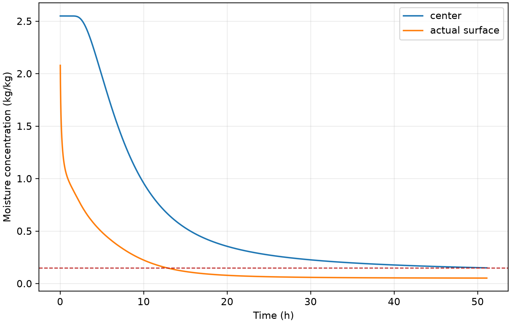

# 第四问：收缩圆柱的移动边界温湿耦合模型

## 1. 问题分析

附件 2 表明药材半径在烘干过程中由 2.000 cm 逐渐缩至约 1.198 cm。若仍在初始半径的固定网格上求解，会把已经收缩消失的外层误当作传质区域，同时漏掉几何缩短带来的扩散尺度变化。已有食品干燥研究通常用收缩修正、等效对流项或移动边界描述这一过程 [1-4]。本题已经给出半径历史，因而把 \(R(t)\) 作为实测输入比另设不可识别的力学收缩本构更合适。

本文沿用前三问的一维轴对称 Fourier--Fick 框架，将物理半径归一化为固定坐标 \(\xi=r/R(t)\)，在移动材料坐标内求解附录 4 的变物性方程。该方法直接输出圆柱内部的含水率场，能够按全域阈值而不是平均含水率判定终点。

## 2. 假设与参数

1. 药材截面均匀径向收缩，长度不变；附件 2 的整体半径代表各轴向截面。
2. 干基含水率 \(C\) 随固体骨架运动，局部骨架速度为 \(v_r=(\dot R/R)r\)。初始干物质体积密度均匀，且无干物质损失，因此当前干物质体积密度 \(\rho_d(t)\) 仍空间均匀，满足 \(\rho_d(t)R(t)^2=\rho_{d0}R_0^2\)。
3. 附件 1 和附件 2 的相邻记录分别作线性插值。附件 1 结束后的烘房边界沿用第三问：用最后 1 h 均值作长期平台，并在 60 s 内从末观测值过渡。
4. 附录 4 没有重新给表面系数，故沿用 \(h_T=25\,\mathrm{W/(m^2K)}\)、\(h_m=8\times10^{-7}\,\mathrm{m/s}\)。这是模型假设，不是附录 4 新给参数。
5. 忽略轴向梯度、端面效应、蒸发潜热及热湿交叉系数；题目没有给识别这些效应所需的数据。
6. 附录 4 的 \(\rho(C)c_p(C)\) 在本简化模型中作为经验有效体积热容使用。它与水分守恒中的 \(\rho_d\) 分开定义；实测收缩与给定经验密度未形成严格的热力学、力学和质量守恒联合闭合，详见第 6 节的相容性诊断。

附录 4 的物性为

\[
\rho(C)=760+90C,
\quad c_p(C)=1850+2150\frac{C}{C+1},
\]
\[
k(C)=0.12+0.20\frac{C}{C+1},
\]
\[
D(C,T)=4.2\times10^{-4}
\exp\!\left(-\frac{0.30}{C}\right)
\exp\!\left(-\frac{3850}{T}\right).
\]

程序存储摄氏温度，但计算 \(D\) 时使用 \(T_K=T_{\circ C}+273.15\)。

## 3. 移动边界模型

先从干物质与水分的局部质量守恒出发。令 \(\rho_d\) 为当前体积中的干物质量密度，\(\mathbf j_w\) 为相对固体骨架的水分质量通量：

\[
\partial_t\rho_d+\nabla\!\cdot(\rho_d\mathbf v)=0,
\qquad
\partial_t(\rho_d C)+\nabla\!\cdot(\rho_d C\mathbf v+\mathbf j_w)=0,
\]
\[
\mathbf j_w=-\rho_d D\nabla C
\quad\Longrightarrow\quad
\frac{\mathrm DC}{\mathrm Dt}=\frac1{\rho_d}\nabla\!\cdot(\rho_d D\nabla C).
\]

只有在 \(\rho_d\) 空间均匀的假设下，才能约去空间散度内外的 \(\rho_d\)，得到当前采用的方程。在长度不变、均匀径向收缩时，\(\nabla\!\cdot\mathbf v=2\dot R/R\)，干物质守恒进一步给出上述 \(\rho_d R^2=\mathrm{const}\)。因此物理坐标方程为

\[
\frac{\partial C}{\partial t}+v_r\frac{\partial C}{\partial r}
=\frac1r\frac{\partial}{\partial r}
\left(rD\frac{\partial C}{\partial r}\right).
\]

令 \(\xi=r/R(t)\)。固定 \(\xi\) 的网格速度恰为骨架速度，因此对流项与坐标运动项相消，得到

\[
\rho(C)c_p(C)\frac{\partial T}{\partial t}\bigg|_\xi
=\frac{1}{R(t)^2\xi}\frac{\partial}{\partial\xi}
\left[\xi k(C)\frac{\partial T}{\partial\xi}\right],
\]
\[
\frac{\partial C}{\partial t}\bigg|_\xi
=\frac{1}{R(t)^2\xi}\frac{\partial}{\partial\xi}
\left[\xi D(C,T)\frac{\partial C}{\partial\xi}\right].
\]

圆心满足对称条件 \(T_\xi=C_\xi=0\)。表面 Robin 条件为

\[
-\frac{k}{R}T_\xi=h_T(T_s-T_\infty),
\quad
-\frac{D}{R}C_\xi=h_m(C_s-C_\infty).
\]

定义

\[
g(t)=\max_{0\le\xi\le1} C(\xi,t)-0.15.
\]

烘干临界时刻为 \(g(t)\) 首次等于 0 的时刻；“各处低于 0.15”的严格条件在其后成立，因此同时给出临界时刻和其后的第一个整分钟。

## 4. 数值方法与数据映射

归一化半径上采用守恒的节点型环形有限体积法，界面输运系数取调和平均。时间积分使用适合刚性扩散问题的 BDF 法，并以 \(\log C\) 为水分状态变量，避免数值过程中产生负含水率。正式结果分别使用 640 和 1280 个径向区间，随后按二阶误差进行 Richardson 外推。

题目要求固定物理距离，而计算网格随 \(R(t)\) 变化。对每个时刻，先用 \(\xi=r/R(t)\) 插值到 \(r=0,0.1,\ldots,2.0\) cm；若 \(r>R(t)\)，该位置已在药材外，result4.xlsx 中留空。模板末列“药材表面”单独保存 \(\xi=1\) 的值，不能用固定 2 cm 列替代。

## 5. 计算结果

640 和 1280 区间的临界终点分别为 51.099670 h 和 51.093884 h，二阶外推得到

\[
t_* = 183931.0374\ \mathrm{s}\approx\boxed{51.0920\ \mathrm{h}}.
\]

程序外推值为 51.0919548205 h；其额外小数用于复算比对，不表示具有相同位数的物理预测精度。

临界时刻半径约为 1.200 cm，最大含水率位于中心；未舍入的临界最大值为 0.1500000 kg/kg。若设备只能在整分钟停止，应取 183960 s，即 **51.100000 h**，此时未舍入最大值为 0.1499851 kg/kg，严格满足要求。

**表 6  收缩药材烘干过程的水分浓度（kg/kg）**

| 时间/h | 0 cm | 0.5 cm | 1.0 cm | 药材表面 |
|---:|---:|---:|---:|---:|
| 6 | 1.7196 | 1.5377 | 1.0226 | 0.4207 |
| 12 | 0.7377 | 0.6546 | 0.4083 | 0.1669 |
| 18 | 0.4088 | 0.3687 | 0.2397 | 0.0892 |
| 24 | 0.2851 | 0.2611 | 0.1790 | 0.0673 |
| 30 | 0.2263 | 0.2094 | 0.1493 | 0.0595 |
| 36 | 0.1928 | 0.1797 | 0.1317 | 0.0560 |
| 42 | 0.1712 | 0.1604 | 0.1200 | 0.0541 |
| 48 | 0.1561 | 0.1468 | 0.1116 | 0.0530 |
| 烘干临界时刻 51.091955 | 0.1500 | 0.1413 | 0.1081 | 0.0526 |

6 h 时实测半径已经降至 1.374 cm，之后继续非增，因此 1.5 cm 和 2.0 cm 在表 6 的全部所列时刻均位于实体之外。完整工作簿按题目要求保留全部 0.1 cm 固定位置，并对实体外单元留空。

## 6. 可靠性检验

1. **物性逐式测试。** 自动化测试逐项核对附录 4 的四个经验公式和开尔文温度换算。
2. **退化与方向性。** 固定 \(R(t)=R_0\) 后，移动坐标程序与采用相同附录 4 物性的固定圆柱程序在温湿全场上一致；当初始场与环境完全相等时，即使半径变化，温湿场仍保持常数；热干环境下，表面升温、失水均快于中心。
3. **移动域输出。** 自动化测试确认固定物理半径超出当前实体时输出 NaN，并在工作簿中转换为空白；实际表面始终有独立数值。
4. **网格收敛。** 640/1280 区间的终点差为 20.83 s。320/640 和 640/1280 两组二阶外推相差约 0.98 s，约占总时长 0.0005%，可作为当前空间离散不确定性的量级。
5. **严格终点与表格回读。** 工作簿同时保存临界行和下一整分钟行，浓度按题目要求显示及存储四位小数；未舍入最大值单独保存于计算诊断文件，用其判断严格不等式。工作簿共 3067 行数据，加表头为 3068 行、23 列；生成后逐单元格回读，与计算输出精确比较，并独立用半径历史核验空白掩码。
6. **与固定几何的对照。** 在同样使用附录 4 物性的反事实固定半径模型中，160/320/640/1280 区间终点为 130.6095/130.0145/129.8875/129.8579 h；640/1280 外推约为 **129.8481 h**。实测收缩通过 \(R^{-2}\) 扩散尺度和缩短内部迁移距离显著提前终点。该对照仅用于说明给定模型中的几何效应，不是独立实验验证。
7. **方程通量平衡与最湿点。** 归一化截面平均含水率变化与移动表面通量积分的相对最大残差，在 640/1280 网格下分别为 \(1.61\times10^{-6}\) 和 \(1.69\times10^{-6}\)。全部保存时刻的径向含水率最大向外增量仅为 \(1.33\times10^{-15}\)，支持本算例最湿点位于中心。该检验针对离散水分方程，不等同于经验密度与实测收缩的物理相容性。
8. **半径观测时刻扰动。** 在 320 网格下，将附件 2 的内部观测时刻统一提前或推后半个采样间隔（15 min），终点由基准 51.1236 h 改变为 50.9886 h 和 51.2605 h，即约 -0.135/+0.137 h。这是人为设定的时间扰动情景，并非观测误差估计或置信区间。
9. **真正的插值方法对照。** 保持附件 2 的全部时刻和半径观测不变，在同一 320 网格下将线性插值改为单调 PCHIP，临界时刻提前约 12.603 s。正式结果仍采用透明、可直接核查的线性插值。
10. **传递系数敏感性。** 在同一 320 网格下，\(h_m\) 分别取基准的 0.8/1.0/1.2 倍时，终点为 51.8009/51.1236/50.7400 h，相对本组基准变化 +0.6773/0/-0.3837 h；\(h_T\) 同样变化时，终点为 51.1418/51.1236/51.1117 h。比较应采用本组差值，不与外推终点直接混比。这是参数情景敏感性，不代表已知参数误差分布。
11. **时间积分与独立离散。** 320 网格下，将 \((\mathrm{rtol},\Delta t_{\max})\) 从 \((2\times10^{-8},120\,s)\) 加严至 \((2\times10^{-9},60\,s)\)、\((5\times10^{-10},30\,s)\)，终点最大差约 0.00218 s。另用独立单元中心有限体积实现复算，1600/3200 单元二阶外推为 51.0919474 h；其观测收敛阶仍低于 2，不能把与主结果的接近程度解释为误差保证。6–48 h 的 32 个表 6 数值在该外推下四位小数全部一致。

**密度—收缩相容性诊断。** 若强制把附录 \(\rho(C)\) 解释为当前湿基整体密度，则应有 \(\rho_d=\rho(C)/(1+C)\)。对完整非均匀含水率场计算

\[
M_d(t)=2\pi L R(t)^2\int_0^1\frac{760+90C(\xi,t)}{1+C(\xi,t)}\xi\,\mathrm d\xi,
\]

得到各网格自身临界时刻 \(M_d(t_*)/M_d(0)\) 在 640/1280 网格下分别约为 0.890282/0.890289，即隐含干物质量减少约 **10.97%**。这说明“该密度作为真实湿基密度”“长度不变的实测收缩”“干物质守恒”不能在当前场解中同时严格满足。本文把附录密度限制在经验热容系数的用途，水分方程采用单独定义的空间均匀 \(\rho_d(t)\)；这是一项明确的简化解释，不是通过改名消除了物理不相容，也不是观测到了真实干物质损失。若坚持严格湿密度解释，必须补充孔隙率、局部变形或长度变化等闭合关系并重建耦合模型，现有附件不足以唯一确定这些关系。

全部新增实验、独立离散的收敛限制及建议处理情况见 [第四问优化复核记录](problem4-review-response.md)；机器可读数值保存在该记录链接的 JSON 文件。

第三问的固定半径、附录 3 模型终点为 57.4740 h；第四问为 51.0920 h，减少约 6.38 h。但两问同时改变了物性公式和几何，不能把这 6.38 h 全部归因于收缩。

## 7. 模型评价

本模型直接利用附件 2 的实测几何信息，不额外拟合收缩参数；固定域变换保留了所选水分方程的圆柱通量平衡，也能稳定生成全时空结果。已检验的时间积分误差远小于参数情景变化；绝对终点仍受经验密度与收缩闭合不相容、表面传质系数沿用、4 h 后烘房边界平台解释及一维中段近似影响。若获得长期烘房记录、吸附等温线、局部密度或内部含水率实测，可进一步建立一致闭合并检验绝对终点。

## 参考文献

[1] APRAJEETA J, GOPIRAJAH R, ANANDHARAMAKRISHNAN C. Shrinkage and porosity effects on heat and mass transfer during potato drying[J]. *Journal of Food Engineering*, 2015, 144: 119-128. DOI: 10.1016/j.jfoodeng.2014.08.004.

[2] BRASIELLO A, ADILETTA G, RUSSO P, et al. Mathematical modeling of eggplant drying: Shrinkage effect[J]. *Journal of Food Engineering*, 2013, 114(1): 99-105. DOI: 10.1016/j.jfoodeng.2012.07.031.

[3] ADROVER A, BRASIELLO A, PONSO G. A moving boundary model for food isothermal drying and shrinkage: General setting[J]. *Journal of Food Engineering*, 2019, 244: 178-191. DOI: 10.1016/j.jfoodeng.2018.09.018.

[4] ADROVER A, VENDITTI C, BRASIELLO A. A non-isothermal moving-boundary model for continuous and intermittent drying of pears[J]. *Foods*, 2020, 9(11): 1577. DOI: 10.3390/foods9111577.

[5] KASSIS T, AGARWAL V, HE Y, PATEL D, BRUECKNER A M. Scientific Agent Skills: A Library of Procedural Knowledge for Research Agents[EB/OL]. arXiv:2609.00065, 2026. DOI: 10.48550/arXiv.2609.00065.

## AI 使用说明

本问在代码实现、数值检验、工作簿生成和文字初稿中使用了 OpenAI Codex，并参考 Scientific Agent Skills 的程序化研究与表格工作流 [5]。所有题面公式、附件数据、数值结果和参考文献均应由参赛队成员在提交前逐项复核；AI 生成内容不替代作者对模型选择、计算正确性和论文陈述的责任。
