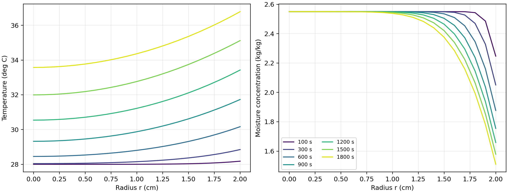
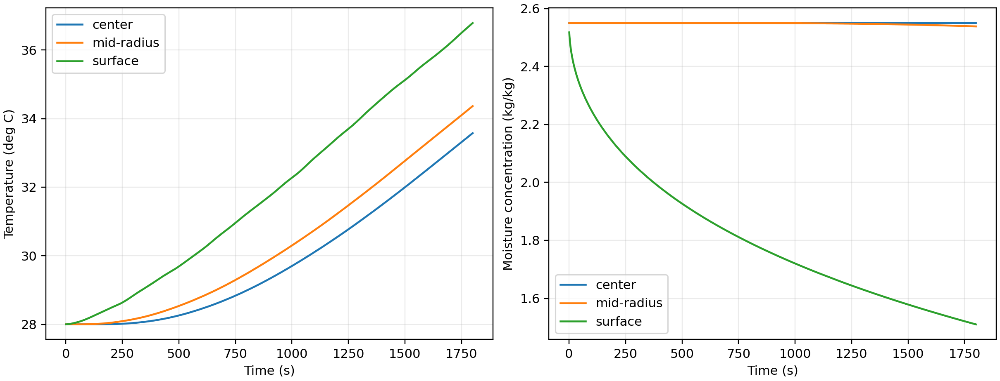

# 第一问：固定半径预热阶段的温度场与水分场

## 1. 问题分析与模型选择

药材为半径 $R=2\ \mathrm{cm}$、长度 $L=25\ \mathrm{cm}$ 的圆柱。题目要求给出沿半径方向的分布，且没有提供端面与侧面不同的传热传质参数，因此把圆柱中段视为轴对称、仅沿径向传输的一维区域。该处理与圆柱物料干燥中常用的 Fourier 导热—Fick 扩散模型一致 [1-3]。二维模型可以刻画端部效应，但需要额外的端面边界信息，故本问不引入不可识别参数 [4]。

第一问预热阶段半径保持不变；热传导与水分扩散通过各自的第三类边界受到干燥室环境历史驱动。本问给出的热物性均为常数，扩散系数只依赖水分浓度，因而两个场可以分别求解。题面未给蒸发潜热或 Luikov 交叉系数，因此不在能量方程中自行加入相变热或热湿交叉项 [5]。

## 2. 模型假设

1. 药材内部各向同性、轴对称，忽略周向变化和圆柱中段的轴向梯度。
2. 第一问圆柱半径不变，密度、比热容、导热系数采用题给常数。
3. 附件 1 中每 60 s 的环境温度、水分浓度在相邻记录之间作线性插值。
4. 表面传热与传质系数在预热阶段保持不变。
5. 题中固相水分浓度与环境水分浓度都以 kg/kg 给出，缺少气固平衡分配关系；据题意把二者之差直接作为有效传质推动力。这是题设层面的有效边界假设，而不是气固两相质量基准完全相同的物理断言。

## 3. 控制方程

设 $T(r,t)$ 为药材温度，$C(r,t)$ 为水分浓度。固定圆柱内的径向导热方程为

\[
\rho c_p\frac{\partial T}{\partial t}
=\frac{1}{r}\frac{\partial}{\partial r}
\left(kr\frac{\partial T}{\partial r}\right),
\qquad 0<r<R.
\]

水分迁移用浓度相关的 Fick 有效扩散方程描述：

\[
\frac{\partial C}{\partial t}
=\frac{1}{r}\frac{\partial}{\partial r}
\left[rD(C)\frac{\partial C}{\partial r}\right],
\]

\[
D(C)=7\times10^{-9}\exp\!\left(-\frac{0.89}{C}\right)
\quad (\mathrm{m^2/s}).
\]

题面中的扩散系数公式已经逐字复核：指数为负，分母是局部浓度 $C$。参数取值为

\[
\rho=820\ \mathrm{kg/m^3},\quad c_p=2600\ \mathrm{J/(kg\,K)},\quad
k=0.36\ \mathrm{W/(m\,K)},
\]

\[
h_T=25\ \mathrm{W/(m^2\,K)},\qquad
h_m=8\times10^{-7}\ \mathrm{m/s}.
\]

初始条件为

\[
T(r,0)=28\ ^\circ\mathrm C,\qquad C(r,0)=2.55\ \mathrm{kg/kg}.
\]

圆心处由对称性有

\[
\frac{\partial T}{\partial r}(0,t)=0,\qquad
\frac{\partial C}{\partial r}(0,t)=0.
\]

取径向向外为正方向，表面 Robin 边界为

\[
-k\frac{\partial T}{\partial r}(R,t)
=h_T[T(R,t)-T_\infty(t)],
\]

\[
-D(C)\frac{\partial C}{\partial r}(R,t)
=h_m[C(R,t)-C_\infty(t)].
\]

该符号保证 $T_\infty>T(R,t)$ 时净热流进入药材，且 $C(R,t)>C_\infty$ 时净水分通量流出药材。

## 4. 数值方法

在节点周围构造同心环形控制体。对一般变量 $u$ 及输运系数 $\Gamma$，第 $i$ 个控制体的半离散形式为

\[
s_iV_i\frac{\mathrm du_i}{\mathrm dt}
=2\pi r_{i+1/2}\Gamma_{i+1/2}
\frac{u_{i+1}-u_i}{\Delta r}
-2\pi r_{i-1/2}\Gamma_{i-1/2}
\frac{u_i-u_{i-1}}{\Delta r},
\]

其中

\[
s_i=\begin{cases}
\rho c_p,&u=T,\ \Gamma=k,\\
1,&u=C,\ \Gamma=D,
\end{cases}
\qquad
V_i=\pi(r_{i+1/2}^2-r_{i-1/2}^2).
\]

界面系数采用调和平均。圆心控制体的内表面积自然为零，避免直接计算方程中的 $1/r$ 奇点；表面控制体直接加入 Robin 边界通量。时间方向使用适合刚性扩散方程的 BDF 隐式积分，并以 $\log C$ 为水分状态量以保证 $C>0$。分别使用 5120 与 10240 个径向区间计算，在相同输出节点上按二阶误差作 Richardson 外推。最后把外推解输出到 $r=0,0.1,\ldots,2.0\ \mathrm{cm}$，并按题意保留四位小数。

## 5. 计算结果

下表列出部分代表时刻和位置；完整的 1--1800 s、21 个半径位置结果见 `outputs/result1.xlsx`。

**表 1  代表位置温度 $T/{}^\circ\mathrm C$**

| 时间/s | 0 cm | 0.5 cm | 1.0 cm | 1.5 cm | 2.0 cm |
|---:|---:|---:|---:|---:|---:|
| 100 | 28.0001 | 28.0003 | 28.0040 | 28.0327 | 28.1801 |
| 300 | 28.0408 | 28.0635 | 28.1514 | 28.3681 | 28.8489 |
| 600 | 28.4533 | 28.5360 | 28.8039 | 29.3159 | 30.1652 |
| 900 | 29.3243 | 29.4583 | 29.8755 | 30.6161 | 31.7304 |
| 1200 | 30.5427 | 30.7098 | 31.2223 | 32.1126 | 33.4276 |
| 1500 | 31.9957 | 32.1867 | 32.7660 | 33.7463 | 35.1203 |
| 1800 | 33.5753 | 33.7720 | 34.3642 | 35.3621 | 36.7856 |

**表 2  代表位置水分浓度 $C/(\mathrm{kg/kg})$**

| 时间/s | 0 cm | 0.5 cm | 1.0 cm | 1.5 cm | 2.0 cm |
|---:|---:|---:|---:|---:|---:|
| 100 | 2.5500 | 2.5500 | 2.5500 | 2.5500 | 2.2470 |
| 300 | 2.5500 | 2.5500 | 2.5500 | 2.5492 | 2.0508 |
| 600 | 2.5500 | 2.5500 | 2.5500 | 2.5353 | 1.8770 |
| 900 | 2.5500 | 2.5500 | 2.5497 | 2.5045 | 1.7547 |
| 1200 | 2.5500 | 2.5500 | 2.5482 | 2.4646 | 1.6586 |
| 1500 | 2.5500 | 2.5499 | 2.5445 | 2.4206 | 1.5787 |
| 1800 | 2.5500 | 2.5497 | 2.5383 | 2.3755 | 1.5102 |

药材温度由中心向表面逐渐升高，即由表面向中心逐渐降低。1800 s 时表面温度为 $36.7856\ ^\circ\mathrm C$，中心温度为 $33.5753\ ^\circ\mathrm C$，径向温差约 $3.2103\ ^\circ\mathrm C$。水分变化则更集中于表层：1800 s 时表面浓度降至 $1.5102\ \mathrm{kg/kg}$，中心仍约为 $2.5500\ \mathrm{kg/kg}$。这是因为在当前 $C$ 范围内水分扩散系数约为 $10^{-9}\ \mathrm{m^2/s}$ 量级，30 min 内的扩散影响深度远小于半径；水分曲线出现陡峭边界层，而温度场相对平滑。

## 6. 数值可靠性检验

1. **守恒性。** 对封闭边界的离散算子，所有控制体的体积加权变化率之和为零；开放边界时，其和严格等于表面施加的换热或传质通量。自动化测试覆盖了这两种情形。
2. **方向性。** 当环境温度高于药材表面时，计算得到表面升温快于中心；当环境水分浓度低于药材表面时，表面浓度下降快于中心，说明边界符号正确。
3. **网格收敛。** 对工作簿全部 $1800\times21$ 个节点比较 5120 与 10240 个径向区间，最大绝对差为 $1.03\times10^{-6}\ ^\circ\mathrm C$ 和 $4.57\times10^{-6}\ \mathrm{kg/kg}$。由于少数数值恰好靠近四位小数舍入边界，仅比较最大误差仍会产生末位翻转，故正式结果采用二阶 Richardson 外推，而不以单一网格的四舍五入值作为最终值。
4. **输入与输出。** 附件 1 的时间严格递增，覆盖 0--14400 s；第一问只使用其中 0--1800 s。输出时间严格为 1--1800 s，输出半径严格为 0--2 cm、步长 0.1 cm。

## 7. 模型评价

本模型以较少参数给出了题目要求的完整径向温度场和水分场，守恒离散也适合后续推广到变物性和收缩问题。主要局限有两点：一是一维中段模型不描述端面效应；二是题面没有给出气相含湿量与固相干基含水率之间的平衡关系，因此表面传质条件只能按有效浓度差解释。若后续需要更高物理精度，可用二维轴对称模型抽查端部误差，并用实测吸附等温线替换当前有效边界关系。

## 参考文献

[1] SILVA W P, SILVA C M D P S, GAMA F J A. Estimation of thermo-physical properties of products with cylindrical shape during drying: The coupling between mass and heat[J]. Journal of Food Engineering, 2014, 141: 65-73. DOI: 10.1016/j.jfoodeng.2014.05.010.

[2] TZEMPELIKOS D A, MITRAKOS D, VOUROS A P, et al. Numerical modeling of heat and mass transfer during convective drying of cylindrical quince slices[J]. Journal of Food Engineering, 2015, 156: 10-21. DOI: 10.1016/j.jfoodeng.2015.01.017.

[3] KAYA A, AYDIN O, DINCER I. Numerical modeling of forced-convection drying of cylindrical moist objects[J]. Numerical Heat Transfer, Part A: Applications, 2007, 51(9): 843-854. DOI: 10.1080/10407780601112753.

[4] HUSSAIN M M, DINCER I. Two-dimensional heat and moisture transfer analysis of a cylindrical moist object subjected to drying: A finite-difference approach[J]. International Journal of Heat and Mass Transfer, 2003, 46(21): 4033-4039. DOI: 10.1016/S0017-9310(03)00229-1.

[5] RIBEIRO J W, COTTA R M, MIKHAILOV M D. Integral transform solution of Luikov's equations for heat and mass transfer in capillary porous media[J]. International Journal of Heat and Mass Transfer, 1993, 36(18): 4467-4475. DOI: 10.1016/0017-9310(93)90131-O.
